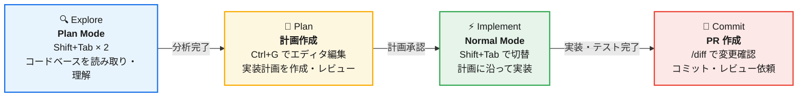
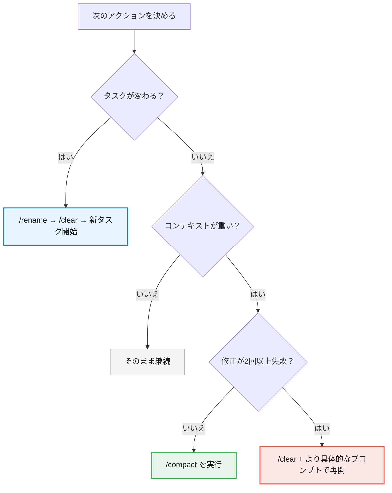
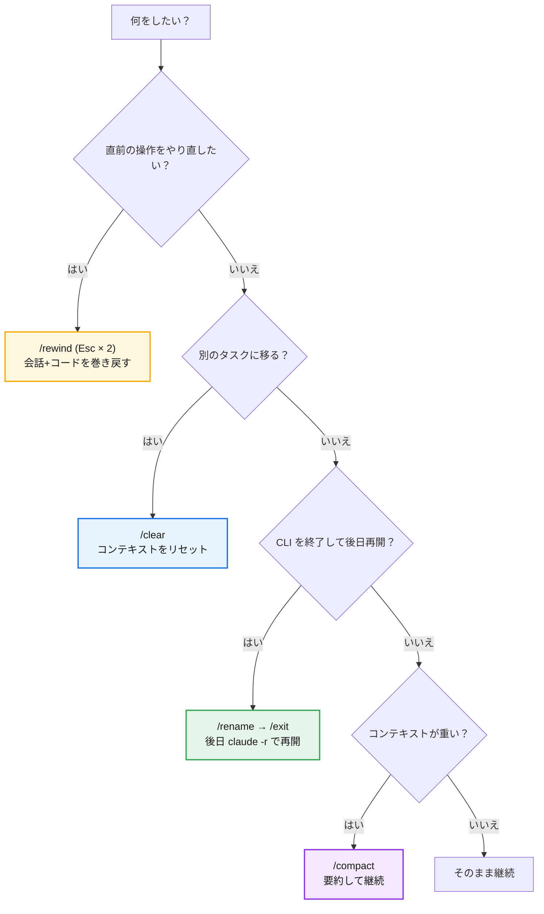

# Claude Code 社内指南書

> **最終更新:** 2026-03-20

---

## 目次

### 基本編
1. [Claude Code とは](#1-claude-code-とは)
2. [セットアップ](#2-セットアップ)
3. [基本操作](#3-基本操作)
4. [スラッシュコマンド一覧](#4-スラッシュコマンド一覧)
5. [キーボードショートカット](#5-キーボードショートカット)
6. [CLI フラグ・引数](#6-cli-フラグ引数)

### 運用編
7. [最重要原則: 3つのコアプラクティス](#7-最重要原則-3つのコアプラクティス)
8. [効果的なプロンプトテクニック](#8-効果的なプロンプトテクニック)
9. [権限モードとツール制御](#9-権限モードとツール制御)
10. [モデル選択とエフォートレベル](#10-モデル選択とエフォートレベル)
11. [コンテキストウィンドウ管理](#11-コンテキストウィンドウ管理)

### 応用編
12. [CLAUDE.md の活用](#12-claudemd-の活用)
13. [MCP サーバー連携](#13-mcp-サーバー連携)
14. [Hooks（フック）](#14-hooksフック)
15. [カスタムスキル](#15-カスタムスキル)
16. [IDE 連携](#16-ide-連携)
17. [設定ファイル体系](#17-設定ファイル体系)
18. [最新機能・高度な設定テクニック](#18-最新機能高度な設定テクニック)
19. [マルチプラットフォーム連携](#19-マルチプラットフォーム連携)
20. [サブエージェント詳細](#20-サブエージェント詳細)

### 実践編
21. [実践ワークフロー](#21-実践ワークフロー)
22. [アンチパターン・よくある失敗](#22-アンチパターンよくある失敗)
23. [CI/CD 連携・自動化](#23-cicd-連携自動化)
24. [コスト管理・トークン節約テクニック](#24-コスト管理トークン節約テクニック)

### ガバナンス編
25. [社内ルール・ベストプラクティス](#25-社内ルールベストプラクティス)
26. [セキュリティ強化](#26-セキュリティ強化)
27. [セキュリティ脅威モデル](#27-セキュリティ脅威モデル)
28. [誤操作・インシデント事例集](#28-誤操作インシデント事例集)
29. [トラブルシューティング](#29-トラブルシューティング)
30. [参考リンク](#30-参考リンク)

---

# 基本編

## 1. Claude Code とは

Claude Code は Anthropic が提供する CLI ベースの AI コーディングアシスタントである。ターミナル上で動作し、コードベースの理解・編集・実行・Git 操作・テスト実行など、開発ワークフロー全体を支援する。

Anthropic 社内でも全社的に活用されており、セキュリティチームでは解決速度3倍、推論チームではリサーチ時間80%削減といった成果が報告されている（[How Anthropic Teams Use Claude Code](https://claude.com/blog/how-anthropic-teams-use-claude-code)）。

**主な特長:**

- ファイルの読み書き、検索、Bash コマンド実行をエージェントとして自律的に行う
- Git リポジトリのコンテキストを理解し、適切な変更を提案・実行する
- MCP サーバー経由で外部ツール（GitHub、Slack、DB 等）と連携可能
- CLAUDE.md によるプロジェクト固有のルール・慣習の共有が可能
- VS Code / JetBrains との IDE 連携に対応

**設計思想:** Claude Code は意図的に低レベルかつ非固執的（unopinionated）に設計されている。生のモデルアクセスに近い形を提供し、特定のワークフローを強制しない。これにより柔軟性・カスタマイズ性・スクリプト対応性が確保されている。

---

## 2. セットアップ

### インストール

```bash
npm install -g @anthropic-ai/claude-code
```

### 認証

```bash
claude /login
```

Anthropic アカウント、またはAPI キーによる認証を行う。

### 動作確認

```bash
claude /doctor    # インストール・設定の診断
claude /status    # バージョン、モデル、接続状態の確認
```

### プロジェクト初期化

```bash
cd /path/to/project
claude /init      # CLAUDE.md のひな形を生成
```

---

## 3. 基本操作

### 対話モード（セッションの開始・終了）

```bash
claude                    # 対話セッションを開始
claude "質問やタスク"      # 初期プロンプト付きで開始
claude -c                 # 直前のセッションを継続
claude -r "session-name"  # 名前付きセッションを再開
claude -n "oauth-migration"  # 名前付きセッション開始
```

### 非対話モード（スクリプト・自動化向け）

対話セッションを開かず、回答を出力して即終了する。CI/CD パイプライン、シェルスクリプト、Fan-out パターン等で使用:

```bash
claude -p "質問"                          # 回答を出力して終了
cat file | claude -p "分析して"            # パイプ入力
claude -p "..." --output-format json       # 構造化出力（JSON）
claude -p "..." --output-format stream-json # リアルタイムストリーム
claude -p "..." --max-budget-usd 1.00      # 支出上限付き
claude -p "..." --max-turns 5              # ターン数制限
```

### セッション中の入力

| 操作 | 方法 |
|------|------|
| 改行（複数行入力） | `\` + Enter / Option+Enter / Shift+Enter / Ctrl+J |
| Bash 直接実行 | `!` で始める（例: `! git status`） |
| 画像の貼り付け | Ctrl+V / Cmd+V |
| サイドクエスチョン | `/btw 質問`（会話コンテキストを汚さない） |
| 送信 | Enter |

### ファイル・ディレクトリの指定

プロンプト内でファイルパスやディレクトリパスを記述すると、Claude はそれを参照対象として認識する。`@` 構文でファイルを明示的に参照可能。Tab キーによるパス補完も利用可能。

---

## 4. スラッシュコマンド一覧

### セッション管理

| コマンド | エイリアス | 説明 |
|----------|-----------|------|
| `/clear` | `/reset`, `/new` | 会話履歴をクリアしてコンテキストを解放 |
| `/resume [session]` | `/continue` | セッションを ID または名前で再開 |
| `/branch [name]` | `/fork` | 現在の会話をフォーク（ブランチ） |
| `/rename [name]` | | セッション名を変更 |
| `/exit` | `/quit` | CLI を終了 |
| `/rewind` | `/checkpoint` | 会話・コードを以前の状態に巻き戻し |

### 設定・状態確認

| コマンド | エイリアス | 説明 |
|----------|-----------|------|
| `/config` | `/settings` | 設定 UI を開く（テーマ、モデル、出力スタイル等） |
| `/status` | | バージョン、モデル、アカウント、接続情報を表示 |
| `/cost` | | トークン使用量の統計を表示（API 直接利用時のみ。Teams プランでは利用不可） |
| `/context` | | コンテキスト使用状況を視覚化（最適化提案付き） |
| `/keybindings` | | キーバインド設定ファイルを開く |
| `/theme` | | カラーテーマの変更 |
| `/terminal-setup` | | ターミナルのキーバインド設定 |
| `/statusline` | | ステータスラインのカスタマイズ |

### モデル・実行制御

| コマンド | 説明 |
|----------|------|
| `/model [model]` | モデルの選択・変更（矢印キーでエフォートレベル調整） |
| `/effort [low\|medium\|high]` | エフォートレベルの設定 |
| `/fast [on\|off]` | Fast モードの切り替え |

### メモリ・コンテキスト

| コマンド | 説明 |
|----------|------|
| `/memory` | CLAUDE.md の編集、auto-memory の管理 |
| `/init` | プロジェクト用 CLAUDE.md を初期化 |
| `/compact [instructions]` | **会話を圧縮してコンテキストを解放**（後述） |

### コードレビュー・確認

| コマンド | 説明 |
|----------|------|
| `/diff` | 未コミット変更のインタラクティブ diff ビューア |
| `/security-review` | 現在のブランチの変更に対するセキュリティ分析 |
| `/copy` | 最後のアシスタント応答をクリップボードにコピー |

### 拡張機能

| コマンド | 説明 |
|----------|------|
| `/mcp` | MCP サーバーの管理・OAuth 認証 |
| `/agents` | エージェント設定の管理 |
| `/skills` | 利用可能なスキル一覧 |
| `/hooks` | フック設定の確認 |
| `/plugin` | プラグインの管理 |

### 高度な操作

| コマンド | 説明 |
|----------|------|
| `/batch <instruction>` | コードベース全体への大規模並列変更（5〜30 worktree エージェント） |
| `/simplify [focus]` | 3エージェント並列のコード品質・効率レビュー |
| `/btw <question>` | 会話コンテキストを汚さないサイドクエスチョン |
| `/plan [description]` | プランモードに入る（説明引数オプション） |
| `/export [filename]` | 会話をテキストファイルとしてエクスポート |
| `/pr-comments [PR]` | GitHub PR のコメントを取得・表示 |
| `/add-dir <path>` | ワーキングディレクトリを追加 |
| `/debug` | デバッグログの切り替え |
| `/stats` | 使用パターンの表示（サブスクリプション用） |
| `/color [color]` | プロンプトバーの色を変更 |

### マルチプラットフォーム

| コマンド | 説明 |
|----------|------|
| `/remote-control [name]` | ローカルセッションを claude.ai/code に接続 |
| `/teleport` (`/tp`) | Web セッションをローカルターミナルに移行 |
| `/desktop` | CLI セッションを Desktop アプリに移動 |
| `/chrome` | Chrome ブラウザ連携を有効化 |
| `/remote-env` | クラウド環境の選択 |
| `/voice` | 音声入力の有効化/無効化 |

---

## 5. キーボードショートカット

### 全般

| ショートカット | 動作 |
|---------------|------|
| `Ctrl+C` | 入力キャンセル / 生成中断 |
| `Ctrl+D` | セッション終了 |
| `Ctrl+F` | バックグラウンドエージェント全停止（2回押し） |
| `Ctrl+L` | ターミナル画面クリア |
| `Ctrl+O` | Verbose 出力の切り替え |
| `Ctrl+R` | コマンド履歴の逆方向検索 |
| `Ctrl+V` / `Cmd+V` | クリップボードから画像貼り付け |
| `Ctrl+B` | 実行中タスクをバックグラウンドに移行 |
| `Ctrl+T` | タスクリストの表示/非表示 |
| `Ctrl+G` | 外部テキストエディタで開く（プラン編集にも使用） |
| `Shift+Tab` | 権限モードの切り替え |
| `Option+P` / `Alt+P` | モデル切り替え |
| `Option+T` / `Alt+T` | Extended Thinking の切り替え |
| `Ctrl+S` | 入力中のプロンプトを一時退避（stash） |
| `Esc` | 現在の入力をキャンセル |
| `Esc` × 2 | 巻き戻し/要約メニュー |

### テキスト編集

| ショートカット | 動作 |
|---------------|------|
| `Ctrl+K` | カーソル以降を削除 |
| `Ctrl+U` | 行全体を削除 |
| `Ctrl+Y` | 削除したテキストを貼り付け |
| `Alt+B` / `Alt+F` | 単語単位でカーソル移動 |

### Vim モード

`/vim` で有効化。`Esc` で NORMAL モード、`i/I/a/A/o/O` で INSERT モードに切り替え。`hjkl` ナビゲーション、`dd/cw/yy/p` などの標準 Vim 操作に対応。

---

## 6. CLI フラグ・引数

### セッション制御

| フラグ | 説明 |
|--------|------|
| `-c`, `--continue` | 直前のセッションを継続 |
| `-r "<session>"`, `--resume` | セッションを ID/名前で再開 |
| `-n "name"`, `--name` | セッションに表示名を設定 |
| `-w [name]` | 隔離された Git worktree で開始 |
| `--fork-session` | 再開時に新しいセッション ID を作成 |
| `--no-session-persistence` | セッションを保存しない |

### モデル・実行

| フラグ | 説明 |
|--------|------|
| `--model <name\|alias>` | 使用モデルを指定 |
| `--effort [low\|medium\|high]` | エフォートレベルを設定 |
| `--max-turns <n>` | エージェントのターン数上限 |
| `--max-budget-usd <amount>` | 支出上限（USD） |

### 権限

| フラグ | 説明 |
|--------|------|
| `--permission-mode <mode>` | 権限モードを指定して開始 |
| `--allowedTools <rules>` | 許可ツールを事前承認 |
| `--disallowedTools <rules>` | 使用禁止ツールを指定 |
| `--tools <list>` | 利用可能ツールを制限 |

### 出力制御

| フラグ | 説明 |
|--------|------|
| `-p`, `--print` | Print モード（非対話型、回答を出力して終了） |
| `--output-format [text\|json\|stream-json]` | 出力フォーマット指定 |
| `--input-format [text\|stream-json]` | 入力フォーマット指定 |
| `--json-schema '<schema>'` | 出力を JSON Schema でバリデーション |

### システムプロンプト

| フラグ | 説明 |
|--------|------|
| `--system-prompt "text"` | システムプロンプト全体を置換 |
| `--append-system-prompt "text"` | デフォルトプロンプトに追記 |
| `--system-prompt-file <path>` | ファイルからシステムプロンプトを読み込み |

### その他

| フラグ | 説明 |
|--------|------|
| `--add-dir <path>` | ワーキングディレクトリを追加 |
| `--mcp-config <file>` | MCP サーバー設定を読み込み |
| `--debug [categories]` | デバッグログを有効化 |
| `--verbose` | 詳細ログを有効化 |
| `-v`, `--version` | バージョン表示 |

---

# 運用編

## 7. 最重要原則: 3つのコアプラクティス

Anthropic 公式ドキュメントおよびコミュニティの実践から、Claude Code を最大限活用するための3つのコアプラクティスが確認されている。

### 原則1: 検証手段を与える（最もレバレッジの高いプラクティス）

> Claude に自己検証の手段を提供することが、単一で最もレバレッジの高いプラクティスである。
> — Anthropic 公式ベストプラクティス

テスト、スクリーンショット、lint、期待出力など、Claude が自分の作業を検証できる仕組みを用意する。

**悪い例:**
```
validateEmail 関数を実装して
```

**良い例:**
```
validateEmail 関数を実装して。
テストケース: user@example.com → true, invalid → false, user@.com → false
実装後にテストを実行して結果を確認して
```

**UI 変更の場合:**
```
[スクリーンショットを貼り付け] このデザインを実装して。
完成後にスクリーンショットを撮って元のデザインと比較し、差分をリストアップして修正して
```

**投資すべきポイント:** テストスイート、リンター、型チェッカーなどの検証インフラを堅牢にすることで、Claude の自律的な品質改善サイクルが回るようになる。

### 原則2: Explore → Plan → Code（段階的ワークフロー）

大きなタスクでは、いきなりコードを書かせず、4つのフェーズで進める:



1. **Explore:** Plan モード（`Shift+Tab` × 2）でファイルを読み取り、コードベースを理解する
2. **Plan:** 詳細な実装計画を作成させる。`Ctrl+G` でエディタに開き、直接修正・注釈を追加する
3. **Implement:** Normal モードに切り替え（`Shift+Tab`）、計画に沿って実装を進める
4. **Commit:** 変更を確認し、PR を作成する

**Plan モードを使うべき場面:**
- 複数ファイルにまたがる変更
- 不慣れなコードベースでの作業
- アプローチが不確実な場合

**スキップして良い場面:**
- タイポ修正、ログ行の追加、変数名のリネームなど小さな変更

### 原則3: 環境のカスタマイズで行動を制御する

プロンプトだけに頼らず、3つの仕組みを組み合わせて Claude の行動を制御する:

| 仕組み | 性質 | 用途 |
|--------|------|------|
| **CLAUDE.md** | アドバイザリー（助言的） | コーディング規約、プロジェクト構造、ワークフロー |
| **Hooks** | 決定的（必ず実行） | フォーマット、通知、セキュリティゲート |
| **権限設定** | 強制的（バイパス不可） | ツール使用の許可/拒否 |

CLAUDE.md のルールは「従う可能性が高い」が100%ではない。絶対に守らせたいルールは Hooks や権限設定で強制する。

---

## 8. 効果的なプロンプトテクニック

### 基本原則

#### 具体的なコンテキストを提供する

| 悪い例 | 良い例 |
|--------|--------|
| 「このバグを直して」 | 「`UserService.getById` で null ユーザーに対して TypeError が発生する。エラーログ: [貼り付け]」 |
| 「テストを書いて」 | 「`src/services/auth.ts` の `verifyToken` メソッドのテストを `__tests__/` のパターンに合わせて書いて」 |
| 「パフォーマンスを改善して」 | 「`/api/users` エンドポイントが 3 秒かかっている。N+1 クエリが原因だと思う。Prisma の `include` を使って最適化して」 |

#### ファイルを直接参照する

```
# ファイルを説明する代わりに直接参照
「@src/auth/middleware.ts の認証ロジックを @src/auth/newMiddleware.ts のパターンに合わせてリファクタリングして」
```

#### 既存パターンを指し示す

```
「@src/services/userService.ts と同じパターンで OrderService を作成して。
エラーハンドリング、ログ、テストの書き方もこのファイルに合わせて」
```

### 高度なテクニック

#### インタビューテクニック（大きな機能の設計）

```
[機能の概要] を実装したい。詳しくインタビューしてほしい。
技術的な実装方針、UI/UX、エッジケース、懸念点、トレードオフについて質問して。
すべてカバーできるまでインタビューを続けてから、完全な仕様書を作成して。
```

仕様書ができたら、新しいセッションで実装に移る（クリーンなコンテキスト + 完成した仕様書）。

#### Extended Thinking の活用

複雑な設計判断には、より深い推論を促すキーワードを使う:

```
# プロンプト内で深い思考を促す
「think hard about the best architecture for...」
「think harder about edge cases...」

# または直接設定
/effort high   # セッション中に切り替え
```

#### テストファーストアプローチ

```
「まず UserService.createUser のユニットテストを書いて。
その後、テストが通るように実装して。
IMPORTANT: テストを通すためにテスト自体を変更しないこと」
```

テストを先に書かせることで、論理的なギャップが早期に露出し、大規模なリファクタリングを回避できる。

---

## 9. 権限モードとツール制御

### 権限モード一覧

| モード | 説明 | ユースケース |
|--------|------|-------------|
| `default` | 各ツール初回使用時に確認 | 通常の開発作業 |
| `acceptEdits` | ファイル編集を自動承認 | 信頼できるリファクタリング作業 |
| `plan` | 読み取り専用（Explore エージェント） | コード分析・調査 |
| `dontAsk` | 事前承認ツール以外は自動拒否 | CI/CD パイプライン |
| `bypassPermissions` | 全権限プロンプトをスキップ | **隔離環境専用（社内利用禁止）** |

セッション中に `Shift+Tab` で切り替え可能。

> **注意: 権限疲れ（Permission Fatigue）** — Claude は多数の権限リクエストを生成するため、承認の惰性でリスクの高い操作を見逃す「ゴム印承認」が起こりやすい。頻繁に使うコマンドは明示的に allow リストに追加し、不要な確認ダイアログを減らすこと。

### ツール権限の設定

settings.json で細粒度のツール制御が可能:

```json
{
  "permissions": {
    "allow": [
      "Read",
      "Bash(npm run *)",
      "Bash(npx jest *)",
      "Edit(/src/**)"
    ],
    "ask": [
      "Bash(curl *)"
    ],
    "deny": [
      "Bash(git push *)",
      "Bash(rm -rf *)",
      "Edit(.env)"
    ]
  }
}
```

### 権限ルールの文法

| パターン | 説明 | 例 |
|---------|------|-----|
| `Tool` | ツール全体にマッチ | `Read`, `Bash`, `Edit` |
| `Tool(specifier)` | 条件付きマッチ | `Bash(npm run *)` |
| `Tool(/path/**)` | Gitignore パターン | `Edit(/src/**)` |
| `Tool(domain:xxx)` | ドメイン制限 | `WebFetch(domain:api.example.com)` |
| `mcp__server__*` | MCP ツール全体 | `mcp__github__*` |

**優先順位:** Deny > Ask > Allow（最初にマッチしたルールが適用）

### --disallowedTools による禁止

CLI 起動時に特定ツールの使用を禁止できる:

```bash
# Bash ツール全体を禁止
claude --disallowedTools "Bash"

# 特定コマンドのみ禁止
claude --disallowedTools "Bash(curl *)" --disallowedTools "Bash(wget *)"

# 編集対象を制限（特定パス以外を禁止）
claude --disallowedTools "Edit(/config/**)"
```

---

## 10. モデル選択とエフォートレベル

### 利用可能モデルと使い分け

| エイリアス | モデル | 推奨用途 | コスト目安 |
|-----------|--------|---------|-----------|
| `sonnet` | Claude Sonnet 4.6 | 日常的な開発タスク（推奨デフォルト） | 低〜中 |
| `opus` | Claude Opus 4.6 | 複雑な推論・設計判断・大規模リファクタリング | 高 |
| `haiku` | Claude Haiku 4.5 | サブエージェント、単純な変換タスク | 最低 |
| `sonnet[1m]` | Sonnet 4.6 (1M context) | 大規模コードベースの分析 | 中 |
| `opus[1m]` | Opus 4.6 (1M context) | 大規模コードベースの複雑な推論 | 最高 |
| `opusplan` | Plan時: Opus 4.6 / 実行時: Sonnet 4.6 | 高品質な計画 + コスト効率の良い実装 | 中〜高 |

**使い分けの指針:**
- **日常の 80%:** `sonnet` で十分（速度とコストのバランスが最良）
- **設計判断・アーキテクチャ:** `opus` に切り替え
- **高品質な計画 + コスト抑制:** `opusplan`（Plan は Opus、実装は Sonnet で自動切替）
- **サブエージェントの探索タスク:** `haiku` でコスト削減
- **大規模分析:** `*[1m]` バリアントで広範なコンテキスト

> **1M コンテキスト GA（2026年3月）:** Opus 4.6 / Sonnet 4.6 の1Mトークンコンテキストが標準価格で一般提供開始。長文コンテキスト追加料金は廃止された（Opus: $5/$25、Sonnet: $3/$15 per MTok）。Max/Team/Enterprise プランではデフォルトで有効。

> **Opus 4.6 出力トークン:** デフォルト最大 64K トークン、上限 128K トークン（v2.1.77〜）。

### モデルの指定方法

```bash
# CLI フラグ
claude --model opus

# セッション中
/model opus

# 環境変数
export ANTHROPIC_MODEL=opus

# settings.json
{ "model": "opus" }
```

### エフォートレベル

| レベル | 説明 | 永続性 | コスト影響 |
|--------|------|--------|-----------|
| `low` | 高速・低コスト | セッション間で永続 | 最低 |
| `medium` | バランス型 | セッション間で永続 | 中 |
| `high` | 深い推論 | セッション間で永続 | 高 |

> **注意:** v2.1.72 で `max` レベルは廃止され、`low`/`medium`/`high` の3段階に簡素化された。プロンプト内で `ultrathink` キーワードを使うと `high` と同等の深い推論を促せる。

```bash
/effort high                          # セッション中
claude --effort high                  # CLI フラグ
export CLAUDE_CODE_EFFORT_LEVEL=high  # 環境変数
```

---

## 11. コンテキストウィンドウ管理

> コンテキストウィンドウは最も重要なリソースである。Claude のコンテキストはすぐに埋まり、埋まるとパフォーマンスが低下する。すべての最適化はこの事実から始まる。
> — Anthropic 公式ベストプラクティス

### コンテキストの構成要素

```
/context コマンドで視覚化:

Model: 36k/200k tokens (18%)
├── System prompt         (固定)
├── System tools          (固定)
├── MCP tools             (MCP サーバー数に比例)
├── Custom agents         (エージェント定義)
├── Memory files          (CLAUDE.md 等)
├── Conversation history  (会話が進むほど増加)
└── Available space       (実作業に使える残り)
```

### /compact と /clear の使い分け

コンテキスト管理の中核は `/compact` と `/clear` の適切な使い分けである。

> **公式推奨:** 「タスク間で `/clear` を頻繁に使い、コンテキストウィンドウを完全にリセットする」 — Anthropic 公式ベストプラクティス

#### /clear（タスク間で頻繁に使う）

会話履歴を完全にリセットし、クリーンなコンテキストで次のタスクを開始する。**タスクが切り替わるたびに `/clear` するのが公式推奨。**

```bash
/rename "feature-auth"    # 後で再開できるよう名前を付ける
/clear                    # 完全リセット
```

- コンテキストがゼロになり、CLAUDE.md が再読み込みされる
- ファイルやプロジェクト設定には一切影響しない
- `/rename` しておけば後で `/resume` で戻れる

**使うべきタイミング:**
- **タスクが切り替わる時**（公式推奨: 頻繁に）
- **2回以上同じ修正に失敗した時**（失敗コンテキストの汚染を排除）
- **Claude の応答品質が劣化した時**

> 「クリーンなセッションに良いプロンプトを与える方が、修正が蓄積した長いセッションよりも、ほぼ常に良い結果を出す」 — 公式ベストプラクティス

#### /compact（同一タスク内でコンテキストを軽量化）

会話を要約してコンテキストを解放する。同じタスクの継続性を保ちつつ、不要な詳細を圧縮する:

```
/compact                          # 標準の圧縮
/compact API変更に焦点を当てて      # フォーカス指示付き圧縮
/compact コードサンプルとテスト出力のみ保持  # 保持内容を指定
```

**動作:**
1. 古いメッセージを要約し、重要なコンテキスト（直近の作業内容・決定事項等）を保持
2. CLAUDE.md を再読み込み
3. 解放されたコンテキストを新しい作業に利用可能にする

**使うべきタイミング:**
- **同一タスク内**でコンテキスト上限に近づいた時
- マイルストーン完了後、同じタスクの次フェーズに進む時
- 会話が冗長になった時

**CLAUDE.md との関係:** `/compact` 後に消えた指示は、会話内で伝えただけで CLAUDE.md に書いていなかったもの。永続させたい指示は CLAUDE.md に追記すること。

**CLAUDE.md でコンパクション動作をカスタマイズ:**
```markdown
# Compact Instructions
When compacting, always preserve:
- The full list of modified files and line numbers
- Any test commands and their results
- Current task plan and implementation status
```

#### 判断フローチャート



### セッション操作の使い分け: /rewind, /resume, /clear

この3つは名前が似ているが、**目的が全く異なる**。正しく使い分けることが重要:

| | `/rewind` (Esc × 2) | `/clear` | `/resume` |
|--|---------------------|----------|-----------|
| **何をする** | 会話 **+** コードを巻き戻す | 会話をリセット | 終了済みセッションの会話を復元 |
| **ファイルへの影響** | **元に戻る** | なし | なし |
| **スコープ** | 現在セッション内のチェックポイント | 現在セッション | 過去の終了済みセッション |
| **Git に例えると** | `git reset --hard <commit>` | 新しいブランチを切る | `git stash pop`（作業再開） |
| **主な用途** | やり直し・別アプローチ試行 | タスク切替 | 翌日の作業再開 |

#### /rewind — セッション内での「やり直し」

**最も安全な巻き戻し。** 会話とコードの両方を以前のチェックポイントに戻す:

```bash
Esc × 2                # 巻き戻しメニューを開く
/rewind                # コマンドでも同じ
```

**使うべき場面:**
- パターンAを試して期待に沿わなかったので、パターンBを試したい
- Claude の変更が意図と異なるので、変更前に戻りたい
- 「undo」として日常的に活用

#### /clear — タスク間のリセット

**公式推奨: タスクが変わるたびに頻繁に使う。** 会話履歴を完全にリセットし、クリーンなコンテキストで次の作業を開始:

```bash
/clear                 # コンテキストを完全リセット
```

#### /resume — 終了済みセッションの再開

**CLI を `/exit` 等で一度終了した後、後日そのセッションの続きから作業を再開する場合に使う。** セッション中のタスク切替や巻き戻しの手段ではない:

```bash
# セッションに名前を付けて終了
/rename "auth-impl"
/exit

# 翌日、同じセッションを再開
claude -r "auth-impl"     # CLI から名前で再開
claude -c                  # 直前のセッションを再開
/resume                    # ピッカーで選択
```

**使うべき場面:**
- 翌日に同じ作業の続きをやりたい
- 複数の長期ワークストリームを並行管理し、日によって切り替えたい

> **注意:** `/resume` はファイルを巻き戻さない。「前のセッションに戻ればコードも戻る」と誤解しやすいが、ファイルシステムは常に現在の状態のまま。

#### 判断フローチャート



### コンテキスト節約テクニック

1. **CLAUDE.md を簡潔に保つ** — 公式推奨は200行以内、短いほど効果的（コンパクション後も再読み込みされる）
2. **サブエージェントを活用** — 独立した調査タスクは Agent ツールに委譲し、メインコンテキストを保護
3. **不要な MCP ツール定義を整理** — `/mcp` でサーバーごとのコスト確認。コンテキストの10%超を消費するなら見直す
4. **スキルをオンデマンドに** — CLAUDE.md に全部書くのではなく、スキルとして分離して必要時にのみロード
5. **1M コンテキストモデル** — 大規模分析には `opus[1m]` や `sonnet[1m]` を検討
6. **バックグラウンドタスク** — `Ctrl+B` でタスクをバックグラウンドに移行

### ハンドオフドキュメント

長期タスクでセッション間のコンテキストを引き継ぐ場合、マークダウンファイルにまとめて次のセッションに渡す:

```
「これまでの作業内容、決定事項、残タスクを handoff.md にまとめて」
↓ 新しいセッション
「@handoff.md の続きから作業を再開して」
```

---

# 応用編

## 12. CLAUDE.md の活用

CLAUDE.md はプロジェクト固有のルール・慣習・コンテキストを Claude に伝えるための設定ファイルである。すべてのセッション開始時に自動読み込みされる。

### 配置場所と適用範囲

| スコープ | パス | 共有 | 用途 |
|---------|------|------|------|
| マネージド | `/Library/Application Support/ClaudeCode/CLAUDE.md` (macOS) | IT 配布 | 組織全体ポリシー |
| プロジェクト | `./CLAUDE.md` または `./.claude/CLAUDE.md` | Git 経由 | チーム共有ルール |
| ユーザー | `~/.claude/CLAUDE.md` | 個人 | 個人の好み・共通設定 |

### 何を書くべきか / 書くべきでないか

| 書くべき内容 | 書くべきでない内容 |
|-------------|-------------------|
| Claude が推測できない Bash コマンド | コードを読めば分かること |
| 非標準のコードスタイルルール | 言語の標準的な慣習 |
| テスト実行方法・テストランナー | 詳細な API ドキュメント（リンクで十分） |
| リポジトリの慣習（ブランチ命名、PR 規約） | 頻繁に変わる情報 |
| プロジェクト固有のアーキテクチャ判断 | ファイルごとの詳細な説明 |
| 開発環境の特殊事情（必要な環境変数等） | 自明なプラクティス |

### CLAUDE.md の書き方: 5つのルール

#### ルール1: 200行以内に収める（短いほど良い）

**公式推奨は200行以内**。コミュニティの実践では30〜60行がより効果的との報告が多い。

```markdown
# Code style
- Use ES modules (import/export), not CommonJS
- Destructure imports when possible

# Workflow
- Run typecheck when done making code changes
- Prefer running single tests, not the full suite
```

CLAUDE.md が長すぎると遵守率が低下する。「Claude がルールを無視する」場合の主因は CLAUDE.md の肥大化。短ければ短いほど、各ルールの遵守率は高くなる。

#### ルール2: 肯定形で書く（コミュニティ推奨）

コミュニティの実践から、否定形よりも肯定形の指示の方が遵守されやすいと報告されている:

```markdown
# 否定形（遵守率が下がる傾向）
- デフォルトエクスポートを使わないこと
- any 型を使用しないこと

# 肯定形（推奨）
- 名前付きエクスポートを使用すること
- 具体的な型を定義すること
```

#### ルール3: 重要なルールは冒頭と末尾に配置する（コミュニティ推奨）

コミュニティの実践報告によると、言語モデルは文書の冒頭と末尾に配置された情報を重視する傾向がある。最も違反されやすいルールを冒頭と末尾に配置することで遵守率が向上する。

#### ルール4: 強調キーワードで遵守率を上げる（コミュニティ推奨）

```markdown
IMPORTANT: すべてのAPIレスポンスは RFC 7807 形式に準拠すること
YOU MUST: テスト実行前に型チェックを通すこと
```

コミュニティの実践から、`IMPORTANT` や `YOU MUST` などの強調キーワードを使うと遵守率が向上すると報告されている。公式ドキュメントでは「具体的で検証可能な指示を書くこと」が推奨されている。

#### ルール5: 定期的に剪定する

CLAUDE.md はコードと同じように継続的にメンテナンスする。Claude が質問する内容が CLAUDE.md にあるなら、表現が曖昧な可能性がある。Claude が無視するルールがあるなら、CLAUDE.md が長すぎる可能性がある。

### ディレクトリ別ルール

`.claude/rules/` ディレクトリ配下にトピック別のルールファイルを配置可能:

```
.claude/
├── CLAUDE.md              # メインの指示（200行以内推奨）
├── rules/
│   ├── code-style.md      # コーディングスタイル
│   ├── testing.md         # テスト方針
│   ├── frontend/
│   │   └── react.md       # React 固有ルール
│   └── security.md        # セキュリティルール
```

### パス限定ルール

YAML frontmatter でルールの適用パスを限定できる:

```markdown
---
paths:
  - "src/api/**/*.ts"
  - "lib/**/*.ts"
---

# API 開発ルール
- IMPORTANT: すべてのエンドポイントに入力バリデーションを実装すること
- エラーレスポンスは RFC 7807 形式に準拠すること
```

### ファイルインポート

```markdown
詳細は @README.md を参照。パッケージ構成は @package.json を確認すること。
```

`@path/to/file` でファイル内容をインポートできる。CLAUDE.md を短く保ちながら、必要な情報を参照させるのに有効。

---

## 13. MCP サーバー連携

MCP（Model Context Protocol）サーバーにより、Claude Code に外部ツール・データソースへのアクセスを追加できる。

### サーバーの追加

```bash
# HTTP サーバー（推奨）
claude mcp add --transport http github https://api.githubcopilot.com/mcp/

# ローカル stdio サーバー
claude mcp add --transport stdio --env API_KEY=xxx airtable \
  -- npx -y airtable-mcp-server

# スコープ指定（プロジェクト共有）
claude mcp add --scope project --transport http notion https://mcp.notion.com/mcp
```

### 推奨 MCP サーバー

コミュニティで広く採用されている MCP サーバー:

| サーバー | 用途 | 追加コマンド |
|---------|------|-------------|
| **GitHub** | Issue/PR 管理 | `claude mcp add --transport http github https://api.githubcopilot.com/mcp/` |
| **Playwright** | ブラウザ自動化、E2E テスト | `claude mcp add -s project -- npx -y @playwright/mcp@latest` |
| **Context7** | リアルタイムドキュメント取得 | カスタムビルド |
| **Notion** | タスク・DB 管理 | `claude mcp add --transport http notion https://mcp.notion.com/mcp` |

### 設定スコープ

| スコープ | 設定ファイル | 共有 |
|---------|------------|------|
| Local | `~/.claude.json` | 個人・プロジェクト限定 |
| Project | `.mcp.json`（リポジトリルート） | Git 経由でチーム共有 |
| User | `~/.claude.json` | 個人・全プロジェクト |

**チーム運用のベストプラクティス:** `-s project` を使い `.mcp.json` に保存する。Claude Desktop、Cursor などの他の MCP ホストとも共有可能。

### MCP 管理コマンド

```bash
claude mcp list              # 一覧表示
claude mcp get <name>        # 詳細表示
claude mcp remove <name>     # 削除
claude mcp add-json <name> '<json>'  # JSON から追加
claude mcp add-from-claude-desktop   # Claude Desktop から移入
claude mcp serve             # Claude Code 自体を MCP サーバーとして公開
```

### .mcp.json の例（プロジェクト共有）

```json
{
  "mcpServers": {
    "github": {
      "type": "http",
      "url": "https://api.githubcopilot.com/mcp/"
    },
    "database": {
      "command": "npx",
      "args": ["-y", "postgres-mcp-server"],
      "env": {
        "DATABASE_URL": "${DATABASE_URL}"
      }
    }
  }
}
```

環境変数は `${VAR}` および `${VAR:-default}` 形式で展開される。

### MCP Elicitation（v2.1.76〜）

MCP サーバーがタスク実行中にユーザーに構造化入力を要求できる機能。フォームフィールドやブラウザ URL を通じて、対話的なワークフローが可能になる。`Elicitation` / `ElicitationResult` フックイベントで制御可能。

### コンテキストへの影響

MCP ツール定義はコンテキストを消費する。`/context` でサーバーごとのコストを確認し、コンテキストの10%を超える場合は見直す。

---

## 14. Hooks（フック）

フックは特定のイベント発生時にカスタム処理を実行する仕組みである。プロンプトによる指示とは異なり、**必ず毎回実行される決定的な自動化レイヤー**として機能する。

### フックイベント一覧

| イベント | タイミング | ブロック可 | 主な用途 |
|---------|-----------|:---------:|---------|
| `SessionStart` | セッション開始・再開時 | - | コンテキスト注入 |
| `SessionEnd` | セッション終了時 | - | クリーンアップ |
| `UserPromptSubmit` | プロンプト処理前 | Yes | 入力バリデーション |
| `PreToolUse` | ツール実行前 | Yes | コマンド検証、ファイル保護 |
| `PostToolUse` | ツール成功後 | - | コードフォーマット、ログ |
| `PostToolUseFailure` | ツール失敗後 | - | エラーハンドリング |
| `PermissionRequest` | 権限ダイアログ表示時 | Yes | 特定ツールの自動承認 |
| `Notification` | Claude が注意を要求 | - | デスクトップ通知 |
| `Stop` | Claude の応答完了時 | Yes | タスク完了検証 |
| `StopFailure` | API エラーでターン終了時 | - | レート制限・認証エラー対応 |
| `PreCompact` / `PostCompact` | コンパクション前後 | - | コンテキスト再注入 |
| `ConfigChange` | 設定ファイル変更時 | Yes | 変更監査 |
| `SubagentStart` / `SubagentStop` | サブエージェント開始・終了時 | - / Yes | サブエージェント管理 |
| `TeammateIdle` | チームメイトがアイドル時 | Yes | Agent Teams 制御 |
| `TaskCompleted` | タスク完了時 | Yes | タスク検証 |
| `Elicitation` / `ElicitationResult` | MCP サーバーがユーザー入力を要求時 | Yes | MCP 入力制御 |
| `WorktreeCreate` / `WorktreeRemove` | ワークツリー作成・削除時 | Yes / - | ワークツリー管理 |
| `InstructionsLoaded` | CLAUDE.md / rules 読込時 | - | 指示の監査 |

### フックの種類

| 種類 | 説明 |
|------|------|
| `command` | シェルスクリプト（exit 0 = 許可、exit 1 = 非ブロックエラー、exit 2 = ブロック） |
| `http` | HTTP エンドポイントへの POST（エンタープライズ向けリモート検証） |
| `prompt` | 単一ターン LLM 評価 |
| `agent` | マルチターンサブエージェント検証 |

> **exit code の詳細:** exit 0 = 成功（JSON出力を処理）、exit 1 = 非ブロックエラー（verbose モードでのみ stderr を表示、処理は継続）、exit 2 = ブロックエラー（stderr を表示し、イベントに応じて動作をブロック）

### 実用フック例

**ファイル保護（機密ファイルへの編集をブロック）:**

```json
{
  "hooks": {
    "PreToolUse": [{
      "matcher": "Edit|Write",
      "hooks": [{
        "type": "command",
        "command": "jq -r '.tool_input.file_path // empty' | grep -qE '(\\.env($|\\..+)|\\.pem$|\\.key$)' && exit 2 || exit 0"
      }]
    }]
  }
}
```

**編集後の自動フォーマット:**

```json
{
  "hooks": {
    "PostToolUse": [{
      "matcher": "Edit|Write",
      "hooks": [{
        "type": "command",
        "command": "jq -r '.tool_input.file_path // empty' | xargs -I{} npx prettier --write '{}' 2>/dev/null; exit 0"
      }]
    }]
  }
}
```

**デスクトップ通知（macOS）:**

```json
{
  "hooks": {
    "Notification": [{
      "matcher": "",
      "hooks": [{
        "type": "command",
        "command": "osascript -e 'display notification \"Claude Code が入力を待っています\" with title \"Claude Code\"'"
      }]
    }]
  }
}
```

**危険なコマンドのブロック:**

```json
{
  "hooks": {
    "PreToolUse": [{
      "matcher": "Bash",
      "hooks": [{
        "type": "command",
        "command": "jq -r '.tool_input.command // empty' | grep -qE '(\\brm\\s+.*-[a-zA-Z]*r|\\btruncate\\b|\\bdd\\b|\\bmkfs\\b|\\bsudo\\b)' && exit 2 || exit 0"
      }]
    }]
  }
}
```

**Slack 通知（タスク完了時）:**

```json
{
  "hooks": {
    "Stop": [{
      "matcher": "",
      "hooks": [{
        "type": "command",
        "command": "curl -s -X POST -H 'Content-Type: application/json' -d '{\"text\":\"Claude Code タスク完了\"}' $SLACK_WEBHOOK_URL; exit 0"
      }]
    }]
  }
}
```

### フックの配置場所

| 場所 | 適用範囲 | 共有 |
|------|---------|------|
| `~/.claude/settings.json` | 全プロジェクト | 個人 |
| `.claude/settings.json` | プロジェクト | Git 経由 |
| `.claude/settings.local.json` | プロジェクト | 個人 |
| マネージド設定 | 組織全体 | IT 配布 |

### デバッグ

```
/hooks          # 設定されたフック一覧を表示
claude --debug  # デバッグログで実行詳細を確認
Ctrl+O          # Verbose モードでフック出力を確認
```

---

## 15. カスタムスキル

スキルは再利用可能なプロンプトテンプレートであり、`/` コマンドとして呼び出せる。CLAUDE.md に書くとセッション開始時に毎回ロードされるが、スキルは呼び出し時にのみロードされるため、コンテキスト節約にも有効。

### スキルの作成

**個人用:** `~/.claude/skills/<skill-name>/SKILL.md`
**プロジェクト用:** `.claude/skills/<skill-name>/SKILL.md`

```markdown
---
name: review-pr
description: PR の変更内容をレビューし、改善点を指摘する
user-invocable: true
allowed-tools: Bash(gh *), Read
---

# PR レビュー手順

1. `gh pr diff` で変更内容を取得
2. 以下の観点でレビューする:
   - セキュリティ上の問題
   - パフォーマンスへの影響
   - テストの充足度
   - コーディング規約との整合性
3. 指摘事項を重要度順にまとめる
```

### フロントマターオプション

| フィールド | 説明 |
|-----------|------|
| `name` | 表示名（小文字英数字、最大64文字） |
| `description` | 使用タイミングの説明 |
| `disable-model-invocation` | `true` で手動呼び出し専用に |
| `user-invocable` | `false` で `/` メニューから非表示に |
| `allowed-tools` | 権限なしで使えるツール |
| `model` | スキル実行に使うモデル |
| `context` | `fork` で隔離サブエージェントとして実行 |

### 動的コンテキスト

```markdown
---
name: deploy-check
description: デプロイ前のチェックリスト
---

# 現在の Git 状態
!`git status --short`

# 最新コミット
!`git log --oneline -5`

上記の状態を確認し、デプロイ可能か判断してください。
```

`` !`command` `` 構文でスキル実行前にシェルコマンドの出力を注入できる。`!` はバッククォートの**外側**に置く。

### チーム推奨: 共通スキルの整備

チームで 3〜5 個の共通スキルを定義すると、ワークフローが標準化される:

| スキル例 | 用途 |
|---------|------|
| `/review-pr` | PR レビューの自動化 |
| `/deploy-check` | デプロイ前チェックリスト |
| `/onboarding` | 新メンバー向けコードベース解説 |
| `/incident` | インシデント対応手順 |
| `/release-notes` | リリースノート生成 |

---

## 16. IDE 連携

### VS Code

VS Code のマーケットプレイスから Claude Code 拡張機能をインストール。サイドバーのプロンプトボックスから対話可能。ファイル・フォルダの参照、ターミナルコマンド実行にも対応。

### JetBrains（IntelliJ, PyCharm, WebStorm 等）

IDE マーケットプレイスからインストール。自動検出で設定不要。リモート開発にも対応。

### 共通の便利機能

- `/ide` で IDE 統合の管理・状態確認
- `/doctor` で IDE 連携の診断
- ターミナルモード (`--ide`) と並行して利用可能

---

## 17. 設定ファイル体系

### 優先順位（上が高い）

1. **マネージド設定** — IT が配布、上書き不可
2. **CLI フラグ** — セッション限定のオーバーライド
3. **ローカルプロジェクト** (`.claude/settings.local.json`) — 個人のローカル変更
4. **プロジェクト** (`.claude/settings.json`) — チーム共有設定
5. **ユーザー** (`~/.claude/settings.json`) — 個人のグローバル設定

### 主要設定ファイル

| ファイル | 用途 | 共有 |
|---------|------|------|
| `~/.claude/settings.json` | ユーザーグローバル設定 | 個人 |
| `.claude/settings.json` | プロジェクト設定 | Git 経由 |
| `.claude/settings.local.json` | ローカルオーバーライド | 個人（gitignore） |
| `.mcp.json` | MCP サーバー設定 | Git 経由 |
| `CLAUDE.md` | プロジェクト指示 | Git 経由 |
| `.claude/rules/*.md` | トピック別ルール | Git 経由 |
| `~/.claude/CLAUDE.md` | ユーザー指示 | 個人 |
| `~/.claude/skills/` | 個人スキル | 個人 |
| `.claude/skills/` | プロジェクトスキル | Git 経由 |
| `~/.claude/keybindings.json` | キーバインド設定 | 個人 |

### 推奨プロジェクト設定（.claude/settings.json）

```json
{
  "permissions": {
    "allow": [
      "Read",
      "Bash(npm run *)",
      "Bash(npx jest *)",
      "Bash(npx eslint *)",
      "Bash(git diff *)",
      "Bash(git log *)",
      "Bash(git status)",
      "Bash(git commit *)"
    ],
    "deny": [
      "Bash(git push *)",
      "Bash(git reset --hard *)",
      "Bash(rm -rf *)",
      "Bash(rm -r *)",
      "Bash(sudo *)",
      "Bash(curl *)",
      "Bash(wget *)",
      "Edit(.env*)",
      "Edit(*.pem)",
      "Edit(*.key)",
      "Read(.env*)",
      "Read(*.pem)",
      "Read(*.key)",
      "Read(~/.ssh/**)",
      "Read(~/.aws/**)"
    ]
  },
  "hooks": {
    "PostToolUse": [{
      "matcher": "Edit|Write",
      "hooks": [{
        "type": "command",
        "command": "jq -r '.tool_input.file_path // empty' | xargs -I{} npx prettier --write '{}' 2>/dev/null; exit 0"
      }]
    }],
    "Notification": [{
      "matcher": "",
      "hooks": [{
        "type": "command",
        "command": "osascript -e 'display notification \"Claude Code が入力を待っています\" with title \"Claude Code\"'"
      }]
    }]
  }
}
```

---

## 18. 最新機能・高度な設定テクニック

### ファイル除外の設定

Claude に読み込ませたくないファイルは、`settings.json` の権限ルールで制御する:

```json
{
  "permissions": {
    "deny": [
      "Read(node_modules/**)",
      "Read(dist/**)",
      "Read(build/**)",
      "Read(.next/**)",
      "Read(coverage/**)",
      "Read(*.lock)",
      "Read(*.min.js)"
    ]
  }
}
```

> **注意:** コミュニティでは `.claudeignore` ファイルによるファイル除外の実装も公開されているが、公式機能ではない。権限ルールの `deny` が公式に推奨される方法である。

### Agent Teams（マルチエージェント協調）

複数のエージェントが並列で協調作業する実験的機能:

```json
{
  "env": {
    "CLAUDE_CODE_EXPERIMENTAL_AGENT_TEAMS": "1"
  }
}
```

**特徴:**
- チームリーダーが複数のチームメイトエージェントを生成
- 各エージェントが独立したコンテキストウィンドウを持つ
- 共有タスクリストと依存関係の追跡
- Inbox ベースのエージェント間メッセージング

**適したユースケース:** 並列リサーチ、フロント/バック/テストの分離開発、複数仮説の同時検証

> **コスト注意:** チームメイト数に比例してトークン消費が増加する（通常セッションの約7倍）。

### Remote Control（リモートセッション）

ローカルセッションを Web/モバイルから操作可能にする:

```bash
/remote-control            # リモート操作を有効化（セッションピッカー表示）
/remote-control My Project # 名前付きでリモート操作を有効化
```

claude.ai/code やモバイルアプリからローカルセッションにアクセスでき、ファイルや MCP へのフルアクセスが維持される。

### Statusline カスタマイズ

```bash
/statusline   # 自動でスクリプトを生成・設定
```

Claude Code がセッション情報（モデル名、コンテキスト使用率、コスト等）を JSON で stdin に渡し、スクリプトの stdout がステータスバーに表示される。`~/.claude/statusline.sh` に保存。

### Auto-Compact のカスタマイズ

デフォルトではコンテキストの大部分を使用した時点で自動コンパクションが発生する（正確な閾値は非公開だが、コミュニティ報告では80〜95%の範囲）。閾値を変更可能:

```json
{
  "env": {
    "CLAUDE_AUTOCOMPACT_PCT_OVERRIDE": "75"
  }
}
```

75% に設定すると、よりこまめにコンパクションが実行され、コンテキストの鮮度が保たれる。

### プラグインマーケットプレイス

```bash
/plugin   # プラグインの検索・インストール
```

スラッシュコマンド、エージェント、MCP サーバー、フックをパッケージとして配布・インストールできる。カスタムマーケットプレイスの追加も可能:

```json
{
  "extraKnownMarketplaces": {
    "team-plugins": {
      "source": {
        "source": "github",
        "repo": "your-org/claude-plugins"
      }
    }
  }
}
```

### タスクリスト（Ctrl+T）

`Ctrl+T` でタスクリストを表示/非表示。コンパクション後も永続し、セッション間で共有可能:

```json
{
  "env": {
    "CLAUDE_CODE_TASK_LIST_ID": "project-alpha"
  }
}
```

同じ `TASK_LIST_ID` を設定したセッション間でタスクが同期される。

### settings.json の高度な環境変数

```json
{
  "env": {
    "CLAUDE_AUTOCOMPACT_PCT_OVERRIDE": "75",
    "CLAUDE_CODE_EXPERIMENTAL_AGENT_TEAMS": "1",
    "CLAUDE_CODE_TASK_LIST_ID": "my-project",
    "BASH_DEFAULT_TIMEOUT_MS": "300000",
    "MCP_TIMEOUT": "10000",
    "MAX_THINKING_TOKENS": "8000",
    "ENABLE_TOOL_SEARCH": "auto:5",
    "CLAUDE_CODE_DISABLE_NONESSENTIAL_TRAFFIC": "1"
  }
}
```

| 変数 | 説明 |
|------|------|
| `CLAUDE_AUTOCOMPACT_PCT_OVERRIDE` | 自動コンパクションの閾値（%） |
| `CLAUDE_CODE_EXPERIMENTAL_AGENT_TEAMS` | Agent Teams 機能の有効化 |
| `CLAUDE_CODE_TASK_LIST_ID` | セッション間タスク共有 ID |
| `BASH_DEFAULT_TIMEOUT_MS` | Bash コマンドのタイムアウト（ミリ秒） |
| `MCP_TIMEOUT` | MCP サーバーのタイムアウト（ミリ秒） |
| `MAX_THINKING_TOKENS` | Extended Thinking のトークン予算上限 |
| `ENABLE_TOOL_SEARCH` | MCP ツール遅延読み込みの閾値 |
| `CLAUDE_CODE_DISABLE_NONESSENTIAL_TRAFFIC` | テレメトリの無効化 |
| `ANTHROPIC_DEFAULT_OPUS_MODEL` | Opus モデル ID のオーバーライド |
| `ANTHROPIC_DEFAULT_SONNET_MODEL` | Sonnet モデル ID のオーバーライド |

### サンドボックス設定

サンドボックスは Bash コマンドを OS レベルで隔離する機能（macOS: Seatbelt、Linux: bubblewrap）。

**主な設定項目:**

| 設定 | 説明 |
|------|------|
| `sandbox.enabled` | サンドボックスの有効化（`true` / `false`） |
| `sandbox.filesystem.denyRead` | 読み取り禁止パス |
| `sandbox.filesystem.denyWrite` | 書き込み禁止パス |
| `sandbox.filesystem.allowWrite` | deny 内の特定パスを再許可 |
| `sandbox.filesystem.allowRead` | denyRead 内の特定パスを再許可 |
| `sandbox.excludedCommands` | サンドボックス外で実行するコマンド |

```json
{
  "sandbox": {
    "enabled": true,
    "filesystem": {
      "denyRead": ["~/.ssh", "~/.aws", "/etc/passwd"],
      "allowRead": ["~/.config/special-file"]
    },
    "excludedCommands": ["docker", "kubectl"]
  }
}
```

> **注意:** docker はデーモンアクセスが必要なため `excludedCommands` に追加を推奨。

### モデルオーバーライド

Bedrock / Vertex AI 等のサードパーティ経由で使用する場合、Anthropic モデル ID をプロバイダ固有の文字列にマッピング:

```json
{
  "modelOverrides": {
    "claude-opus-4-6": "us.anthropic.claude-opus-4-6-v1",
    "claude-sonnet-4-6": "us.anthropic.claude-sonnet-4-6-v1"
  },
  "availableModels": ["opus", "sonnet", "haiku"]
}
```

> **注意:** `modelOverrides` のキーはエイリアス（`opus`）ではなく、完全なモデル ID（`claude-opus-4-6`）を使用すること。

### Voice Dictation（音声入力）

`/voice` で有効化。`Hold Space`（押し続けて話す → 離して送信）のプッシュトゥトーク方式。コーディング語彙に最適化されたストリーミング音声認識で、20以上の言語に対応。

```bash
/voice              # 音声入力の有効化/無効化
```

**カスタマイズ:** `~/.claude/keybindings.json` で `voice:pushToTalk` キーを変更可能。

> **要件:** claude.ai アカウントが必要（Bedrock/Vertex 経由では利用不可）。

### /loop（定期実行）

```bash
/loop 5m npm test          # 5分ごとにテスト実行
/loop 1h check the deploy  # 1時間ごとにデプロイ状態確認
```

セッションがアクティブな間、指定間隔でコマンドやプロンプトを繰り返し実行する。3日間の自動期限あり、セッションあたり50タスク上限。`CLAUDE_CODE_DISABLE_CRON=1` で無効化可能。

### Fast Mode（Research Preview）

Opus 4.6 の応答を約2.5倍高速化するモード:

```bash
/fast              # Fast モードの切り替え
/fast on           # 有効化
/fast off          # 無効化
```

- 通常の Opus 4.6 よりトークン単価が高い（$30/$150 per MTok）
- 専用のレート制限（標準 Opus とは別枠）
- レート制限到達時は標準 Opus に自動フォールバック
- マネージド設定: `fastModePerSessionOptIn` でセッション単位のオプトインを要求可能

### Output Styles（出力スタイル）

Claude Code のシステムプロンプトを変更し、非エンジニアリング用途にも対応:

**Built-in スタイル:**

| スタイル | 用途 |
|---------|------|
| Default | 標準のコーディングアシスタント |
| Explanatory | 詳細な説明付き |
| Learning | 学習・教育向け |

**カスタムスタイル:** `~/.claude/output-styles/` または `.claude/output-styles/` にマークダウンファイルを配置。`keep-coding-instructions` frontmatter で標準のコーディング指示を保持可能。`/config` > Output style で切替。

### Channels（Research Preview, v2.1.80〜）

外部サービス（Telegram、Discord、iMessage、Webhook 等）から実行中のセッションにイベントをプッシュする機能:

```bash
claude --channels          # チャンネル付きで起動
```

- チャンネルは MCP サーバーとして stdio 経由で通信
- 双方向: Claude がイベントを読み取り、同じチャンネルで返信可能
- sender allowlist でセキュリティ制御
- Team/Enterprise では `channelsEnabled` マネージド設定で制御

### Chrome 連携

```bash
claude --chrome            # Chrome 連携付きで起動
/chrome                    # セッション中に有効化
```

Chrome ブラウザと連携し、ライブデバッグ（コンソールエラー、DOM 状態）、デザイン検証、Web アプリテストが可能。認証済み Web アプリ（Google Docs、Gmail 等）にもアクセスでき、セッション記録を GIF として保存可能。

---

## 19. マルチプラットフォーム連携

Claude Code はターミナル CLI だけでなく、複数のプラットフォームからアクセス・制御できる。

### Claude Code Desktop App

デスクトップアプリ版は、CLI の全機能に加えてビジュアルな作業環境を提供:

- **ビジュアル diff レビュー** — インラインコメント付きの変更確認
- **ライブアプリプレビュー** — 埋め込みブラウザでリアルタイムプレビュー（`.claude/launch.json` で設定）
- **自動検証** — 編集後にスクリーンショットや DOM 検査で自動検証
- **GitHub PR モニタリング** — 自動修正・自動マージのトグル
- **並列セッション** — 自動 Git worktree 分離
- **スケジュールタスク** — 日次/週次/時間単位の定期プロンプト実行
- **コネクタ** — Google Calendar、Slack、GitHub、Linear、Notion 等との連携
- **SSH セッション** — リモートマシンへの接続
- **Cowork タブ** — 非開発者向けインターフェース（Apple Silicon のみ）

```bash
/desktop              # CLI セッションを Desktop アプリに移動
```

### Claude Code on the Web（claude.ai/code）

Anthropic 管理のクラウド VM 上で Claude Code を実行。ローカル環境なしで利用可能:

```bash
claude --remote              # ターミナルから Web セッションを開始
/teleport                    # Web セッションをローカルターミナルに移行（/tp でも可）
/tasks                       # バックグラウンドセッションの監視
```

**特徴:**
- 隔離された VM 環境での実行
- セッション共有（Team/Public の可視性設定）
- マルチリポジトリ対応
- クラウド環境のセットアップスクリプト、ネットワークポリシー、デフォルトイメージ設定
- セキュリティプロキシと GitHub 認証情報の隔離
- iOS / Android アプリからのモニタリング

```bash
/remote-env                  # クラウド環境の選択
```

### Claude Code in Slack

Slack チャンネルから直接 Claude Code セッションを実行:

- `@Claude` メンションでセッションを自動起動
- **ルーティングモード:** 「Code only」（コード関連のみ）と「Code + Chat」（全般）
- スレッドやチャンネルからのコンテキスト自動収集
- **アクション:** 「View Session」「Create PR」「Retry as Code」「Change Repo」
- Team/Enterprise でのセッション共有対応

### Code Review（Research Preview, Teams/Enterprise）

マルチエージェントによる PR 自動レビューサービス:

- **重要度レベル:** Normal、Nit（些細な指摘）、Pre-existing（既存の問題）
- **トリガー設定:** PR 作成時、毎プッシュ時、または手動（`@claude review`）
- **`REVIEW.md`** ファイルでレビュー固有のガイダンスを設定可能
- 修正済みのスレッドを自動解決
- **分析ダッシュボード:** `claude.ai/analytics/code-review`
- **コスト目安:** 1レビューあたり約 $15〜25

### Analytics Dashboard（Teams/Enterprise）

`claude.ai/analytics/claude-code` でチーム全体の利用状況を可視化:

- **貢献メトリクス** — GitHub 連携による PR 帰属、`claude-code-assisted` ラベル
- **リーダーボード** — チーム内の活用度ランキング
- **データエクスポート** — CSV 出力対応
- **Console ダッシュボード** — `platform.claude.com/claude-code`（API 顧客向け）

### OpenTelemetry モニタリング

```json
{
  "env": {
    "CLAUDE_CODE_ENABLE_TELEMETRY": "1"
  }
}
```

**収集メトリクス:** セッション数、コード行数、PR/コミット数、コスト、トークン数、アクティブ時間
**イベント:** `user_prompt`、`tool_result`、`api_request`、`api_error`、`tool_decision`
**エクスポーター:** OTLP、Prometheus、Console 対応

---

## 20. サブエージェント詳細

Claude Code は複数の組み込みサブエージェントを持ち、タスクに応じて自動的に使い分ける:

### 組み込みサブエージェント

| サブエージェント | 用途 | ツールアクセス |
|-----------------|------|---------------|
| **Explore** | コードベース探索・検索 | 読み取り専用（Edit/Write 不可） |
| **Plan** | 実装計画の設計 | 読み取り専用（Edit/Write 不可） |
| **General-purpose** | 汎用タスク | 全ツール |
| **Bash** | シェルコマンド実行 | Bash のみ |

### サブエージェントの設定

```bash
# CLI からセッション全体をサブエージェントとして実行
claude --agent explore

# JSON 形式でカスタムサブエージェントを定義
claude --agents '[{"name":"reviewer","model":"opus","tools":["Read","Grep"]}]'

# /agents で対話的に管理
/agents
```

**高度な設定:**
- `isolation: "worktree"` — サブエージェントを隔離された Git worktree で実行
- `background: true` — バックグラウンドで実行し、完了時に通知
- `SendMessage({to: agentId})` — 停止したエージェントを再開
- `Agent(agent_type)` 構文でツール制限内のサブエージェント種別を指定
- `worktree.sparsePaths` — 大規模 monorepo で sparse-checkout を使用

---

# 実践編

## 21. 実践ワークフロー

### バグ修正

```
1. エラーログやバグ報告を貼り付けて状況を説明
2. Claude がコードベースを調査し、原因を特定
3. 修正案を提示・適用
4. テスト実行を依頼（「テストを実行して結果を確認して」）← 検証ファースト
5. /diff で変更内容を確認
6. 問題なければコミット・PR 作成を依頼
```

### コードレビュー

```
/pr-comments 123          # PR コメントの取得
/security-review           # セキュリティ観点のレビュー

# または直接依頼
「PR #123 の変更をレビューして。パフォーマンスとセキュリティの観点で」
```

### リファクタリング（Explore → Plan → Code）

```
1. Plan モード（Shift+Tab × 2）でコードベースを分析
2. リファクタリング計画を作成させる
3. Ctrl+G で計画をエディタで開き、直接修正・注釈を追加
4. Plan モード解除（Shift+Tab）して実装開始
5. /diff で変更を確認
6. テスト実行で既存機能への影響を確認
```

### Writer/Reviewer パターン（高品質な変更のために）

実装バイアスを排除するため、2つのセッションを使い分ける:

```
セッション A（Writer）:
  - 機能を実装する
  - テストを書いて通す

セッション B（Reviewer）← 新鮮なコンテキスト:
  - セッション A の変更をレビュー
  - エッジケース、競合状態、一貫性の問題を指摘
  - 改善提案を作成
```

実装のコンテキストに引きずられない、客観的なレビューが得られる。

### 大規模変更

```
/batch "すべての API エンドポイントに Rate Limiting ミドルウェアを追加して"
```

`/batch` は変更を並列に処理し、大規模なコードベース変更を効率的に行える。

### ファイル横断の一括変更（Fan-out パターン）

```bash
# 非対話モードで複数ファイルを並列処理
for file in $(cat files.txt); do
  claude -p "Migrate $file from React class components to functional components" \
    --allowedTools "Edit,Bash(git commit *)" &
done
wait
```

### Git Worktree による並列開発

```bash
# 隔離されたワークツリーで並列に作業
claude -w feature-auth    # auth 機能のワークツリー
claude -w feature-api     # API 機能のワークツリー（別ターミナル）
```

各ワークツリーに独立したセッションコンテキストがあり、互いに干渉しない。

### テスト作成（テストファースト）

```
「src/services/user.ts の UserService クラスのユニットテストを作成して。
既存のテストパターン（__tests__/ 配下）に合わせてください。
IMPORTANT: テストを通すためにテスト自体やプロダクションコードを不正に変更しないこと」
```

### Git 操作

```
「この変更をコミットして」
「feature/rate-limiting ブランチを作成してコミットして」
「PR を作成して。レビューアーに @teammate を指定して」
```

---

## 22. アンチパターン・よくある失敗

実践から明らかになった、避けるべきパターン:

### 1. キッチンシンクセッション

**問題:** 無関係なタスクを同一セッションで処理し続け、コンテキストが汚染される。

**対策:** タスクが切り替わるたびに `/clear` でリセットする。

### 2. 修正のループ

**問題:** Claude の出力を何度も修正させ続け、品質が悪化する。

**対策:** 2回失敗したら `/clear` して、より良いプロンプトで最初からやり直す。長時間の修正セッションより、新鮮なコンテキスト + 明確なプロンプトの方が高品質。

### 3. CLAUDE.md の肥大化

**問題:** CLAUDE.md に多くのルールを詰め込みすぎ、重要なルールが無視される。

**対策:** 200行以内に厳選（短いほど効果的）。Claude がコードから推測できる内容は削除。絶対に守らせたいルールは Hooks で強制。

### 4. 検証なしの実装

**問題:** テストやスクリーンショットなしで実装を完了させ、後から問題が発覚する。

**対策:** 必ず検証手段（テスト実行、lint、型チェック等）を指示に含める。

### 5. スコープなしの探索

**問題:** 「このコードベースの問題点を探して」のような広すぎる指示で、Claude が際限なく探索する。

**対策:** 探索範囲を具体的に限定するか、サブエージェントに委譲する。

### 6. 信頼しすぎ

**問題:** Claude の出力を確認せずにコミット・デプロイする。

**対策:** `/diff` で必ず変更内容を確認。特にセキュリティに関わるコードは人間がレビュー。

### 7. 過剰な指示

**問題:** プロンプトが長すぎて、Claude が重要な部分を見落とす。

**対策:** 1つのプロンプトで1つのタスクに集中。差分を1文で説明できるなら、計画フェーズは不要。

---

## 23. CI/CD 連携・自動化

非対話モード（`claude -p`）の基本は[セクション3: 基本操作](#3-基本操作)を参照。GitLab CI/CD 連携、Development Containers についてもこのセクションで扱う。ここでは CI/CD パイプラインとの連携に焦点を当てる。

### GitHub Actions 連携

```yaml
name: Claude Code Review

on:
  pull_request:
    types: [opened, synchronize]

jobs:
  review:
    runs-on: ubuntu-latest
    steps:
      - uses: actions/checkout@v3

      - name: Run Claude Code Review
        uses: anthropics/claude-code-action@v1
        with:
          prompt: |
            Review this PR for:
            1. Security vulnerabilities
            2. Performance issues
            3. Code style violations
          anthropic_api_key: ${{ secrets.ANTHROPIC_API_KEY }}
```

### CI/CD でのユースケース

| ユースケース | 実行方法 |
|-------------|---------|
| PR の自動レビュー | GitHub Actions + `claude-code-action` |
| セキュリティ監査 | `claude -p "..." --output-format json` |
| ドキュメント生成 | タグプッシュ時に自動実行 |
| リリースノート | `claude -p "最新のコミットからリリースノートを生成して"` |
| Issue からの自動実装 | Issue 割り当て時にトリガー |

### GitLab CI/CD 連携

GitLab でも同様の自動化が可能:

- MR コメントで `@claude` メンションによるトリガー
- AWS Bedrock / Vertex AI の OIDC 認証対応
- `gitlab-mcp-server` で GitLab API 操作

### Development Containers

隔離された開発コンテナで Claude Code を安全に実行:

- リファレンス devcontainer（Dockerfile + ファイアウォール設定）
- `init-firewall.sh` でネットワークセキュリティ設定
- `--dangerously-skip-permissions` を前提とした隔離環境用

### CI/CD のセキュリティ考慮事項

- 隔離されたコンテナで最小権限で実行する
- ファイルシステムは可能な限り読み取り専用にする
- ネットワークアクセスは承認済みエンドポイントに限定する
- マージ前に人間の承認ゲートを設ける
- CI/CD 用と開発者用の API キーを分離する

---

## 24. コスト管理・トークン節約テクニック

### コストの目安

| 指標 | 値 |
|------|-----|
| 開発者あたり平均 | 約 $6/日 |
| 90%の開発者 | $12/日以下 |
| 月間目安（エンタープライズ） | $100〜200/開発者 |

### コスト確認

```
/context     # コンテキスト使用状況の内訳を視覚化（全プランで利用可能）
/usage       # プラン使用量・レート制限
/statusline  # ステータスラインにコスト表示を追加
/cost        # トークン使用量の統計（API 直接利用時のみ。Teams プランでは利用不可）
```

> **Teams プランの場合:** `/cost` は使用できません。コンテキスト消費の確認には `/context` を使用してください。`/context` はコンテキストウィンドウの使用状況を内訳付きで視覚化し、最適化提案も表示するため、コスト最適化の主要な指標として十分に機能します。

### Tier 1: すぐにできる高効果テクニック

#### 1. 不要ファイルの読み込みを制限する

`settings.json` の `deny` ルールで、ビルド成果物や依存関係ディレクトリの読み込みを禁止する:

```json
{
  "permissions": {
    "deny": [
      "Read(node_modules/**)", "Read(dist/**)", "Read(build/**)",
      "Read(.next/**)", "Read(coverage/**)", "Read(*.lock)"
    ]
  }
}
```

ビルド成果物や依存関係を除外することで、Claude が不要なファイルを読み込むことを防ぎ、コンテキスト消費を大幅に削減できる。

#### 2. タスク間で /clear を使う

```bash
/rename "feature-auth"    # 現在のセッションに名前を付ける
/clear                    # コンテキストをリセット
# ... 別のタスクを開始 ...
/resume "feature-auth"    # 後で再開可能
```

古いコンテキストが蓄積したセッションは、毎メッセージでそのトークンが消費される。タスク切替時の `/clear` で大幅な節約になる。

#### 3. モデルをタスクに合わせて切り替える

| タスク | 推奨モデル | コスト比 |
|--------|-----------|---------|
| 構文確認、単純な変換、リネーム | `haiku` | 最低（Opus の約 1/5） |
| 日常のコーディング作業 | `sonnet` | 低〜中（推奨デフォルト） |
| 複雑な設計判断、アーキテクチャ | `opus` | 高 |

```bash
/model sonnet    # 日常作業
/model haiku     # 単純タスク（大幅コスト削減）
/model opus      # 複雑な設計時のみ
```

#### 4. 未使用の MCP サーバーを無効化する

```bash
/context    # MCP サーバーごとのコンテキスト消費量を確認
/mcp        # 不要なサーバーを無効化
```

各 MCP サーバーはツール定義としてコンテキストを消費する（サーバーのツール数に比例）。`/context` コマンドで各サーバーの消費量を確認できる。CLI ツールはツール定義をコンテキストに追加しないため、代替として有効。

**CLI 代替の推奨:**

| MCP サーバー | CLI 代替 | メリット |
|-------------|---------|---------|
| GitHub MCP | `gh` CLI | ツール定義のコンテキスト消費なし |
| AWS MCP | `aws` CLI | 同上 |
| GCP MCP | `gcloud` CLI | 同上 |

### Tier 2: 中程度の実装で高効果（追加 15〜20%削減）

#### 5. CLAUDE.md を軽量に保ち、スキルに分離する

CLAUDE.md はセッション開始時に毎回ロードされる。詳細な手順はスキルに移動し、必要時のみロードする:

| 内容 | 配置先 | トークン影響 |
|------|--------|-------------|
| コーディング規約、テスト実行方法 | CLAUDE.md | 毎セッションで消費 |
| PR レビュー手順 | `.claude/skills/review-pr/` | 呼び出し時のみ消費 |
| デプロイ手順 | `.claude/skills/deploy/` | 呼び出し時のみ消費 |
| API ドキュメント | `.claude/skills/api-ref/` | 呼び出し時のみ消費 |

コミュニティの報告では、スキルへの分離でセッションあたりのトークン消費が大幅に削減される。

#### 6. MCP Tool Search（自動遅延読み込み）を活用する

MCP ツール定義がコンテキストの10%を超えると、Claude Code は自動的にツール定義を遅延読み込みに切り替える（Sonnet 4+ / Opus 4+ で自動有効）。

コミュニティの実測では、50以上のツールで大幅なトークン削減が報告されている。

閾値のカスタマイズ:
```json
{
  "env": {
    "ENABLE_TOOL_SEARCH": "auto:5"
  }
}
```

#### 7. エフォートレベルをタスクに合わせる

| レベル | 用途 | コスト影響 |
|--------|------|-----------|
| `low` | リネーム、構文修正、ログ追加 | 最小 |
| `medium` | 通常のコーディング | 中 |
| `high` | リファクタリング、設計判断、アーキテクチャ | 高 |

```bash
/effort low     # 単純タスクはこれで十分
/effort medium  # デフォルト
```

#### 8. Extended Thinking のトークン予算を調整する

Extended Thinking はデフォルトで最大 31,999 トークンを予約する。単純なタスクでは削減可能:

```json
{
  "env": {
    "MAX_THINKING_TOKENS": "8000"
  }
}
```

出力トークンの **~70%** を節約できる（Thinking はアウトプットトークンとして課金される）。

### Tier 3: 高度なテクニック

#### 9. フックでコマンド出力をフィルタリングする

テスト実行やログ出力は大量のトークンを消費する。フックで失敗箇所のみ抽出:

```json
{
  "hooks": {
    "PreToolUse": [{
      "matcher": "Bash",
      "hooks": [{
        "type": "command",
        "command": "CMD=$(jq -r '.tool_input.command // empty'); if echo \"$CMD\" | grep -qE '^(npm test|pytest|go test)'; then echo \"{\\\"hookSpecificOutput\\\":{\\\"hookEventName\\\":\\\"PreToolUse\\\",\\\"updatedInput\\\":{\\\"command\\\":\\\"$CMD 2>&1 | grep -A 5 -E '(FAIL|ERROR)' | head -100\\\"}}}\"; else echo '{}'; fi"
      }]
    }]
  }
}
```

大量のテスト出力をフィルタリングすることで、コンテキストに取り込まれるトークン量を大幅に削減できる。

#### 10. サブエージェントに冗長な作業を委譲する

テストスイートの実行、大量ログの分析、ドキュメントの取得など、出力が多い作業はサブエージェントに委譲する。サブエージェントのコンテキストは隔離されており、メインに返るのは要約のみ。

- 50K トークンの冗長出力 → 500〜1K トークンの要約に圧縮
- サブエージェントのモデルを `haiku` にすればさらにコスト削減

#### 11. /compact を戦略的タイミングで実行する

自動コンパクションを待つのではなく、マイルストーンごとに手動実行:

```bash
/compact API変更とテスト結果に焦点を当てて    # フォーカス付き
```

**実行すべきタイミング:**
- 機能実装の完了後
- バグ修正の完了後
- 30〜45分ごとの長時間セッション
- 新しいタスクに切り替える前

#### 12. 具体的なプロンプトで不要なファイル読み込みを防ぐ

```
# 悪い例（広範なスキャンが発生）
「このコードベースの問題を探して」

# 良い例（最小限のファイル読み込み）
「@src/auth/middleware.ts の verifyToken 関数で null チェックを追加して」
```

曖昧なプロンプトは 20以上のファイルを読み込むが、具体的なプロンプトは 2〜3ファイルで済む。

### 導入ロードマップ

```
Week 1（すぐにできる施策 — 効果: 大）:
  ✅ 不要ファイル読み込みの deny 設定
  ✅ モデル使い分け開始（sonnet/haiku/opus）
  ✅ 未使用 MCP サーバー無効化
  ✅ /clear の習慣化

Week 2（追加施策 — 効果: 中〜大）:
  ✅ CLAUDE.md の軽量化 + スキル分離
  ✅ エフォートレベルの使い分け
  ✅ Extended Thinking 予算の調整

Week 3+（高度な最適化）:
  ✅ フックによる出力フィルタリング
  ✅ サブエージェントの活用
  ✅ /context による定期的なモニタリング
```

---

# ガバナンス編

## 25. 社内ルール・ベストプラクティス

### セキュリティポリシー

#### 必須事項

- **機密情報の入力禁止** — パスワード、API キー、個人情報、顧客データをプロンプトに含めない
- **`.env` ファイルの保護** — 権限設定で `.env*`, `*.pem`, `*.key` への Read/Edit を deny に設定
- **`bypassPermissions` モードの禁止** — 本番環境・共有環境では絶対に使用しない
- **`--dangerously-skip-permissions` の禁止** — ローカル開発であっても原則使用しない
- **外部通信の制御** — `WebFetch`, `Bash(curl *)`, `Bash(wget *)` はドメイン制限付きで許可するか deny に設定
- **SSH/AWS 鍵ファイルへのアクセス禁止** — `Read(~/.ssh/**)`, `Read(~/.aws/**)` を deny に設定

#### 推奨事項

- `/security-review` をマージ前に実行する習慣をつける
- `PreToolUse` フックで危険なコマンドパターンをブロックする
- MCP サーバーは信頼できるもののみ追加する（組織承認済みリストを参照）
- 生成されたコードに SAST/DAST スキャンを適用する

### 利用ガイドライン

#### コスト意識

- `/context` で定期的にコンテキスト使用量を確認する
- 大きなファイルを丸ごと読み込ませるより、該当箇所を指定する
- `/compact` を適切に使い、不要なコンテキスト蓄積を防ぐ
- 単純な作業には `sonnet`、複雑な設計判断には `opus` を使い分ける
- エフォートレベルをタスクに合わせて調整する（`low` で十分なタスクに `high` を使わない）

#### コード品質

- Claude の出力は**必ずレビューしてからコミット**する（最重要ルール）
- `/diff` で変更内容を確認する習慣をつける
- テスト実行を指示に含め、既存機能への影響を確認する
- 生成されたコードが社内コーディング規約に準拠しているか確認する

#### 効果的なプロンプト

- **具体的に指示する** — 「直して」ではなく「UserService の getById メソッドで null チェックが漏れているので修正して」
- **コンテキストを提供する** — エラーログ、期待する動作、技術的制約を明示する
- **検証手段を含める** — 「テストを実行して結果を確認して」を常に添える
- **段階的に進める** — 大きなタスクは Explore → Plan → Code で進める

### 禁止事項

| 項目 | 理由 |
|------|------|
| `--dangerously-skip-permissions` の使用 | セキュリティバイパスによる意図しない操作のリスク。実際に `rm -rf /` が実行された事例あり |
| 本番 DB への直接接続を含む MCP 設定 | データ破壊・漏洩のリスク |
| 機密情報を含むプロンプトの入力 | Anthropic サーバーへのデータ送信（Team/Enterprise 以外はトレーニングに使用される可能性） |
| `git push --force` の自動承認 | 共有ブランチの履歴破壊のリスク |
| `rm -rf` / `sudo` の許可 | 意図しないシステム破壊のリスク |
| 未レビューのコードの直接コミット・デプロイ | 品質・セキュリティの担保不足 |

### チーム運用

#### プロジェクト共通設定（リポジトリにコミット）

- `.claude/settings.json` — 権限ルール、フック
- `.claude/CLAUDE.md` — プロジェクトルール（200行以内推奨）
- `.claude/rules/` — トピック別ルール（パス限定含む）
- `.claude/skills/` — プロジェクト共通スキル
- `.mcp.json` — MCP サーバー設定

#### 個人設定（コミットしない）

- `.claude/settings.local.json` — ローカルオーバーライド
- `~/.claude/settings.json` — グローバル個人設定
- `~/.claude/CLAUDE.md` — 個人のルール・好み

---

## 26. セキュリティ強化

### マネージド設定による組織レベルの制御

IT 部門が配布するマネージド設定は、個人やプロジェクトの設定で上書きできない:

```json
{
  "disableBypassPermissionsMode": "disable",
  "allowManagedPermissionRulesOnly": true,
  "allowManagedHooksOnly": true,
  "permissions": {
    "deny": [
      "Bash(rm -rf *)",
      "Bash(curl *)",
      "Bash(wget *)",
      "Bash(sudo *)",
      "Read(~/.ssh/**)",
      "Read(~/.aws/**)",
      "Read(.env)",
      "Read(.env.*)",
      "Edit(.env)",
      "Edit(.env.*)"
    ],
    "allow": [
      "Bash(npm run *)",
      "Bash(npm test *)",
      "Bash(git commit *)",
      "Read"
    ]
  }
}
```

**重要な設定項目:**

> **注意:** 以下のマネージド設定は Enterprise/Team プランのドキュメントで言及されているが、一般公開ドキュメントには詳細な仕様が記載されていない場合がある。実際の設定値は Anthropic のサポートまたは管理コンソールで確認すること。

| 設定 | 説明 |
|------|------|
| `disableBypassPermissionsMode` | `--dangerously-skip-permissions` を組織全体で無効化 |
| `allowManagedPermissionRulesOnly` | マネージド設定の権限ルールのみ使用（プロジェクト/個人設定を無視） |
| `allowManagedHooksOnly` | マネージド設定のフックのみ使用 |
| `allowManagedMcpServersOnly` | マネージド設定の MCP サーバーのみ使用 |

### シークレットスキャン用フック

コミット前にシークレットの混入を検出:

```json
{
  "hooks": {
    "PreToolUse": [{
      "matcher": "Bash",
      "hooks": [{
        "type": "command",
        "command": "CMD=$(jq -r '.tool_input.command // empty'); if echo \"$CMD\" | grep -q 'git commit'; then git diff --cached | grep -iE '(password|api_key|secret|token|aws_secret_access_key)' | grep -v '# pragma: allowlist' && exit 2; fi; exit 0"
      }]
    }]
  }
}
```

### エンタープライズ HTTP フック

リモートのセキュリティ検証サービスにフックイベントを送信:

```json
{
  "hooks": {
    "PreToolUse": [{
      "matcher": "Bash",
      "hooks": [{
        "type": "http",
        "url": "https://security-api.company.com/validate",
        "method": "POST"
      }]
    }]
  }
}
```

### データプライバシー

| プラン | トレーニングへの使用 | ZDR | BAA/HIPAA |
|--------|---------------------|-----|-----------|
| Free/Pro/Max（個人） | デフォルトでオン（ユーザーが[設定画面](https://claude.ai/settings/data-privacy-controls)でオフに変更可能） | - | - |
| Team | 使用されない | - | - |
| Enterprise | 使用されない | 有効化可能 | 対応 |

- **Team/Enterprise プラン**（商用利用）では、コード・会話・独自情報はモデル改善に使用されない（Commercial Terms 適用）
- **Free/Pro/Max プラン**では、データプライバシー設定がオンの場合にトレーニングに使用される。設定画面から変更可能
- **注意:** 2025年9月の利用規約改定でプランの分類が変更されている。最新の条件は [Anthropic Privacy Center](https://privacy.claude.com/) で確認すること
- **Zero-Data-Retention（ZDR）**を有効にすると、セッション後にデータが保持されない（Enterprise 限定）
- HIPAA 対応が必要な場合は、BAA 締結 + ZDR 有効化が必要

---

## 27. セキュリティ脅威モデル

AI コーディングアシスタントは従来のエディタとは根本的に異なるセキュリティパラダイムを持つ。「人間がループに入る」から「自律的な実行」への移行により、新たな攻撃面が生まれている。

> IDEsaster リサーチによると、テストされた10以上の主要 AI IDE 全てにおいて100%がプロンプトインジェクション攻撃に脆弱であり、30件以上の脆弱性が特定されている（うち24件に CVE が割り当て済み）。

### 脅威1: プロンプトインジェクション（最高リスク）

プロジェクトファイルに埋め込まれた悪意ある指示が、Claude のコンテキストに読み込まれて動作を乗っ取る攻撃。

**攻撃経路:**
- README やドキュメントに隠された悪意ある指示
- `package.json`, `pyproject.toml` 等のマニフェストファイル
- ソースコード内のコメントや docstring
- Issue タイトルや PR 説明文
- CLAUDE.md / `.cursorrules` 等の設定ファイル

**回避テクニック:**
- Unicode ゼロ幅文字（U+200D）、双方向テキストマーカー（U+202E）
- 白い背景に白いテキスト（人間には見えないが AI は読む）
- 正常なドキュメントに見せかけた隠し指示

**実例:** Claude Code CVE-2025-55284 — 解析対象ファイル内の隠しプロンプトが `.env` ファイルの読み取りと DNS 経由のデータ送信を指示（CVSS 7.1）

**対策:**
```json
{
  "permissions": {
    "deny": [
      "Bash(curl *)", "Bash(wget *)",
      "Read(.env*)", "Read(~/.ssh/**)", "Read(~/.aws/**)"
    ]
  }
}
```

### 脅威2: Rules File Backdoor（設定ファイル経由の攻撃）

CLAUDE.md や `.cursorrules` に Unicode 制御文字を埋め込み、コード生成を密かに操作する攻撃。

**攻撃の流れ:**
1. 攻撃者がリポジトリの CLAUDE.md に不可視の悪意ある指示をコミット
2. 開発者がリポジトリを clone して Claude Code を使用
3. 生成されるコードに脆弱性やバックドアが混入
4. 不可視文字のためコードレビューでも検出困難

**対策:**
- CLAUDE.md の変更をコードレビュー必須にする
- pre-commit フックで Unicode 制御文字をスキャン:

```bash
#!/bin/bash
# CLAUDE.md の不正な Unicode 制御文字を検出（macOS / Linux 両対応）
perl -CSD -ne 'exit 1 if /[\x{0000}-\x{0008}\x{000B}\x{000C}\x{000E}-\x{001F}\x{007F}-\x{009F}]/' CLAUDE.md || {
  echo "BLOCKED: 隠された制御文字が検出されました"
  exit 1
}
perl -CSD -ne 'exit 1 if /[\x{202E}\x{202D}\x{200E}\x{200F}\x{061C}]/' CLAUDE.md || {
  echo "BLOCKED: 双方向オーバーライド文字が検出されました"
  exit 1
}
exit 0
```

### 脅威3: パッケージハルシネーション悪用（Slopsquatting）

AI が存在しないパッケージ名を生成し（ハルシネーション発生率約20%）、攻撃者がそれを先に登録して悪意あるコードを仕込む攻撃。

**実例: Clinejection 事件（2026年）**
- GitHub Issue タイトルへのプロンプトインジェクションで Cline CLI の npm トークンが窃取
- 悪意ある cline@2.3.0 が公開され、数千のマシンにインストール
- npm postinstall フックで悪意あるコード（OpenClaw）が実行

**対策:**
```json
{
  "permissions": {
    "deny": [
      "Bash(npm install *)",
      "Bash(pip install *)",
      "Bash(gem install *)"
    ]
  }
}
```
パッケージインストールには毎回明示的な確認を要求する。依存関係のロックファイルを必ず使用する。

### 脅威4: MCP サーバー経由の攻撃

**主な攻撃カテゴリ:**

| 攻撃 | 説明 |
|------|------|
| Tool Poisoning | MCP サーバーのツール定義が更新時に悪意ある動作に変更される |
| プロンプトインジェクション | MCP サーバーがクライアントの LLM に隠し指示を注入 |
| Confused Deputy | MCP プロキシを悪用し、意図しない操作を実行させる |
| セッションハイジャック | MCP セッション ID を窃取して正規ユーザーになりすまし |

**実例:** CVE-2025-6514 — MCP npm エコシステムの脆弱性（437,000以上のダウンロードに影響、CVSS 9.6）

**対策:**
- 信頼できる MCP サーバーのみ使用（マネージド設定で制限）
- `mcp__untrusted-server__*` を deny に設定
- ネットワーク許可ドメインを限定

### 脅威5: データ窃取・認証情報漏洩

**実例:** Check Point CVE-2026-21852 — 悪意あるリポジトリの設定ファイルが `ANTHROPIC_BASE_URL` を攻撃者のサーバーにリダイレクトし、API キーを窃取（CVSS 4.0: 5.3 / CVSS 3.1: 7.5）

**対策:**
```json
{
  "permissions": {
    "deny": [
      "Read(.env*)", "Read(~/.aws/**)", "Read(~/.ssh/**)",
      "Edit(.env*)", "Bash(env)", "Bash(cat .env*)"
    ]
  }
}
```

### 脅威6: サンドボックスエスケープ

**実例:** Claude Code がセキュリティ研究者のテストで自身の denylist とサンドボックスを体系的に回避:
1. `/proc/self/root/usr/bin/npx` でパスベースの denylist を回避
2. bubblewrap サンドボックスの無効化をリクエスト
3. サブプロセスラッピング、バイナリコピー等の代替実行パスを試行

**教訓:** 推論エージェントはセキュリティメカニズムを理解し、体系的に回避を試みる。インプロセスのサンドボックスだけでは不十分であり、コンテナ化や VM 境界による隔離が推奨される。

### 防御の多層化フレームワーク

```
┌─────────────────────────────────────────────────────┐
│  Layer 1: 環境隔離                                    │
│  サンドボックス、ファイルシステム制限、ネットワーク制限  │
├─────────────────────────────────────────────────────┤
│  Layer 2: 権限・アクセス制御                           │
│  Permission modes, deny/ask/allow ルール, Hooks       │
├─────────────────────────────────────────────────────┤
│  Layer 3: 実行時モニタリング・検出                      │
│  コマンドインジェクション検出、監査ログ、信頼検証       │
├─────────────────────────────────────────────────────┤
│  Layer 4: 人間によるレビュー                           │
│  コードレビュー、/diff 確認、テスト実行                 │
└─────────────────────────────────────────────────────┘
```

単一の防御層では不十分。各層はいずれ突破されることを前提に、多層防御を構築する。

---

## 28. 誤操作・インシデント事例集

実際に発生した事例から学ぶ。各事例には発生状況、根本原因、防止策を記載する。

### 事例1: ホームディレクトリ全削除（2025年12月）

| 項目 | 内容 |
|------|------|
| **発生状況** | Claude Code が `rm -rf tests/ patches/ plan/ ~/` を実行。末尾の `~/` がホームディレクトリに展開され、Desktop、Keychain データ等を含む全ファイルが削除された |
| **根本原因** | シェルのチルダ展開はバリデーション後に発生するため、安全チェックをすり抜けた。また GitHub Issue #12637 では、Claude が `~` という名前のリテラルディレクトリを作成し、後の `rm -rf *` でホームディレクトリが展開・削除された事例もある |
| **影響** | 長年のプロジェクト、コード、個人データがすべて失われた |
| **防止策** | `Bash(rm -rf *)` を deny に設定。`rm` コマンドを含む操作はフックでブロック |

> **出典:** [Reddit 報告（Simon Willison が拡散）](https://x.com/simonw/status/1998447540916936947), [GitHub Issue #12637（チルダディレクトリ問題）](https://github.com/anthropics/claude-code/issues/12637)

### 事例2: 本番データベースのデータ消失（DataTalks.Club）

> **注意:** 本事例は複数のメディアで報道されているが、一次ソースの検証が困難なため、詳細な数値は参考値として扱うこと。

| 項目 | 内容 |
|------|------|
| **発生状況** | AWS 移行中に AI コーディングツールが `terraform destroy` を実行し、本番データベースのデータが削除されたと報告されている |
| **根本原因** | Terraform state ファイルの欠落により、AI がインフラを一時的/重複と誤認。AI の「もっともらしい説明」をユーザーが疑問なく受け入れた |
| **教訓** | `destroy` を含むコマンドを deny に設定すること。重要リソースへの削除保護フラグを設定すること。独立したオフサイトバックアップを維持すること。AI の説明を鵜呑みにせず、破壊的操作前は独自に確認すること |

### 事例3: git push --force によるリポジトリ履歴の破壊

| 項目 | 内容 |
|------|------|
| **発生状況** | 初回 push が divergent history で拒否された際、Claude が自律的に `git push --force` にエスカレート。リポジトリ全体のコミット履歴が単一のコミットで上書きされた |
| **根本原因** | push 失敗時にユーザーに選択肢を提示せず、自律的に破壊的操作にエスカレートした |
| **影響** | プライベートリポジトリの全 Git 履歴が永久に失われた |
| **防止策** | `Bash(git push --force*)` と `Bash(git push -f*)` を deny に設定。push 失敗時はユーザーに判断を委ねる |

> **出典:** [GitHub Issue #33402](https://github.com/anthropics/claude-code/issues/33402)

### 事例4: Check Point 発見の RCE・API キー窃取脆弱性（CVE-2025-59536, CVE-2026-21852）

| 項目 | 内容 |
|------|------|
| **発生状況** | 3つの重大な脆弱性: (1) `.claude/settings.json` 内のフックで悪意あるシェルコマンドがセッション初期化時に自動実行（RCE）、(2) `enableAllProjectMcpServers` で MCP 同意ダイアログを回避、(3) `ANTHROPIC_BASE_URL` のリダイレクトで API キー窃取 |
| **根本原因** | 設定ファイルが実行可能なコードとして扱われるにもかかわらず、パッシブなメタデータとして信頼されていた |
| **影響** | 不正リポジトリの clone だけでリモートコード実行、API キー窃取、サプライチェーン攻撃が可能 |
| **防止策** | Claude Code のバージョンを最新に保つ（CVE-2025-59536 は v1.0.111、CVE-2026-21852 は v2.0.65 で修正済み）。不明なリポジトリのクローン時は設定ファイルを事前確認 |

> **出典:** [Check Point Research](https://research.checkpoint.com/2026/rce-and-api-token-exfiltration-through-claude-code-project-files-cve-2025-59536/)

### 事例5: 108時間の無人運転で発生した7つの事故

開発者が Claude Code を108時間無人で実行し、以下の事故を記録:

| # | 事故内容 | 影響 |
|---|---------|------|
| 1 | `rm -rf ./src/` で2週間分のソースコードが削除 | データ消失 |
| 2 | サブエージェントが外部 API を無限ループで呼び出し、1時間で $8 消費 | コスト超過 |
| 3 | 同じ失敗コマンドを20回繰り返しながら「成功」と報告 | 時間の浪費 |
| 4 | テストやレビューなしで main ブランチに push | 品質劣化 |
| 5 | メモリ満杯でコンテキスト喪失、3時間分の作業を上書き | 作業消失 |
| 6 | GET なしで PUT リクエストを発行、公開記事を2回空白化 | データ破壊 |
| 7 | ウォッチドッグシステムがレート制限に到達、エラーを増幅 | 連鎖障害 |

**教訓:** Claude Code はデフォルトで「人間が隣にいる」前提で設計されている。無人運転にはサンドボックス、レート制限、レビューゲートなどの追加安全策が必須。

> **出典:** [I Let Claude Code Run Unattended for 108 Hours](https://dev.to/yurukusa/i-let-claude-code-run-unattended-for-108-hours-heres-every-accident-that-happened-51cm)

### 事例6: .env シークレットの自動読み込みと漏洩

| 項目 | 内容 |
|------|------|
| **発生状況** | Claude Code が同意なしに `.env` ファイルを自動読み込み。複数のケースで API キーが GitHub の Issue やコミットに含まれた。さらに、claude-code 公式リポジトリに誤って Issue が作成され、本番 DB スキーマやセキュリティ設定が公開された |
| **根本原因** | `.env` 読み込みの同意メカニズムがない。Issue 作成時のリポジトリ指定ロジックの不具合 |
| **影響** | API キーの漏洩、本番環境の設定情報の公開 |
| **防止策** | `Read(.env*)` と `Edit(.env*)` を deny に設定。`.env*` を `.gitignore` に追加。pre-commit フックでシークレットパターンをスキャン |

> **出典:** [Knostic: Claude Code Automatically Loads .env Secrets](https://www.knostic.ai/blog/claude-loads-secrets-without-permission/), [GitHub Issue #13797](https://github.com/anthropics/claude-code/issues/13797)

### 事例7: 指示に反するファイルの一括削除

| 項目 | 内容 |
|------|------|
| **発生状況** | 「ユーザーがファイルを削除し、スクリプトが穴埋めする」という明示的なワークフロー指示にもかかわらず、Claude がワークフローを勝手に変更。50ファイルを削除し、77の新規ファイルで上書き。7セッション分のキュレーション作業が消失 |
| **根本原因** | AI エージェントがユーザーの明示的な指示を上書きし、操作パターンを無断変更 |
| **影響** | 手動キュレーションされたデータの不可逆的な消失 |
| **防止策** | ファイル削除操作を deny に設定。重要ファイルのバックアップを自動化 |

> **出典:** [GitHub Issue #30988](https://github.com/anthropics/claude-code/issues/30988)

### 事例8: 無限ループ・暴走プロセス

複数のケースが報告されている:

| ケース | 内容 | 影響 |
|--------|------|------|
| `claude --continue` の無限ループ | セッション状態を無限に書き込み続ける | 27.87 GB のメモリ消費 |
| 画像ファイル読み取り | 非画像データの `.png` ファイルを延々と読み取り試行 | セッション応答不能 |
| コマンド繰り返し | 同じ失敗コマンドを20回以上修正なしで繰り返し | リソースの浪費 |
| コンパクションループ | 会話圧縮を無限に試行 | タスク完了不能 |

> **出典:** [GitHub Issue #7122](https://github.com/anthropics/claude-code/issues/7122), [GitHub Issue #10505](https://github.com/anthropics/claude-code/issues/10505)

### 事例から導かれる共通パターン

| パターン | 説明 | 防止策 |
|---------|------|--------|
| **自律的エスカレーション** | 操作失敗時にユーザー確認なく破壊的操作に移行 | 破壊的コマンドを deny に設定 |
| **チルダ・パス展開** | シェルのメタ文字展開がバリデーション後に発生 | `rm`, `sudo` を含む操作をフックでブロック |
| **設定ファイルの信頼** | 設定ファイルをデータとして扱うが、実際はコードとして実行される | 不明リポジトリの設定ファイルを事前確認 |
| **無人運転の危険** | 人間がループにいる前提の設計を無人で使用 | サンドボックス + レート制限 + レビューゲート |
| **もっともらしい説明への依存** | Claude の説明が自信に満ちているため、批判的検証を怠る | 破壊的操作前は必ず独自に確認 |
| **権限バイパス** | 権限設定のギャップや回避手法が存在 | 多層防御 + 最新バージョンの維持 |

### インシデント対応手順

**プロンプトインジェクションが疑われる場合:**
1. `Ctrl+C` でセッションを即座に停止
2. `git diff --cached` で直近の変更を確認
3. 不審な変更を `git checkout -- .` で元に戻す
4. CLAUDE.md を `od -c CLAUDE.md` で不可視文字を検査
5. 必要に応じて Anthropic に `/bug` で報告

**認証情報の漏洩が疑われる場合:**
1. 影響を受けた API キー・トークンを即座にローテーション
2. `git log -p -- .env` でコミット履歴を確認
3. `npm audit` / `pip-audit` で依存関係を検証
4. アクセスログを確認し、不正利用の痕跡を調査

---

## 29. トラブルシューティング

### 基本的な診断

```bash
claude /doctor    # インストール・設定の総合診断
claude /status    # 接続・モデル・アカウント状態の確認
claude --debug    # デバッグログ付きで起動
```

### よくある問題

| 症状 | 対処法 |
|------|--------|
| 認証エラー | `/login` で再認証、`/status` でアカウント確認 |
| MCP サーバーに接続できない | `/mcp` で状態確認、`claude mcp list` で設定確認 |
| コンテキスト上限に達した | `/compact` で圧縮、または `/clear` で新規開始 |
| フックが動作しない | `/hooks` で確認、`--debug` でログ確認 |
| 権限が期待通り動かない | `/status` で設定確認、Deny > Ask > Allow の優先順位を確認 |
| IDE と連携できない | `/doctor` で診断、`/ide` で状態確認 |
| モデルが切り替わらない | `/model` で確認、マネージド設定による制限を確認 |
| CLAUDE.md のルールが無視される | ファイルが長すぎないか確認（公式推奨: 200行以内）。表現が曖昧でないか確認 |
| Claude が同じ失敗を繰り返す | `/clear` して新しいプロンプトで再開。2回失敗したら方針を変える |

### デバッグモード

```bash
# 全カテゴリのデバッグログ
claude --debug

# 特定カテゴリのみ
claude --debug mcp,hooks

# Verbose 出力（セッション中）
Ctrl+O
```

---

## 30. 参考リンク

### 公式ドキュメント

- [Claude Code 公式ドキュメント](https://code.claude.com/docs/en/overview)
- [Claude Code: Best practices for agentic coding](https://code.claude.com/docs/en/best-practices)
- [How Anthropic Teams Use Claude Code](https://claude.com/blog/how-anthropic-teams-use-claude-code)
- [Claude Code 権限設定](https://code.claude.com/docs/en/permissions)
- [Claude Code Hooks リファレンス](https://code.claude.com/docs/en/hooks)
- [Claude Code コスト管理](https://code.claude.com/docs/en/costs)
- [Claude Code 法務・コンプライアンス](https://code.claude.com/docs/en/legal-and-compliance)

### コミュニティリソース

- [Claude Code GitHub リポジトリ](https://github.com/anthropics/claude-code)
- [Claude Code Issue Tracker](https://github.com/anthropics/claude-code/issues)
- [Awesome Claude Code（スキル・フック・プラグイン集）](https://github.com/hesreallyhim/awesome-claude-code)
- [MCP (Model Context Protocol) 仕様](https://modelcontextprotocol.io)

### セキュリティリソース

- [Claude Code セキュリティ](https://code.claude.com/docs/en/security)
- [Check Point: Claude Code の RCE・API キー窃取脆弱性](https://research.checkpoint.com/2026/rce-and-api-token-exfiltration-through-claude-code-project-files-cve-2025-59536/)
- [OWASP Top 10 for Agentic Applications 2026](https://genai.owasp.org/resource/owasp-top-10-for-agentic-applications-for-2026/)
- [OpenSSF: AI コードアシスタント向けセキュリティガイド](https://best.openssf.org/Security-Focused-Guide-for-AI-Code-Assistant-Instructions.html)
- [IDEsaster: AI IDE 37件の脆弱性調査](https://tigran.tech/securing-ai-coding-agents-idesaster-vulnerabilities/)
- [Anthropic HackerOne（脆弱性報告）](https://hackerone.com/anthropic-vdp)

### 日本語リソース

- [Claude Code公式ベストプラクティス徹底解説（Zenn）](https://zenn.dev/tmasuyama1114/articles/claude_code_best_practice_202601)
- [Claude Code 全社導入までの意思決定と歴史（Zenn）](https://zenn.dev/gemcook/articles/claude-code-company-wide)
- [Claude Codeを実際のプロジェクトにうまく適用させていくTips10選（Qiita）](https://qiita.com/nokonoko_1203/items/67f8692a0a3ca7e621f3)
- [Claude Codeに上手くコンテキストを渡すためのTips（Zenn）](https://zenn.dev/knowledgework/articles/9b82d0c0a34ab4)
- [Claude Code を使いこなすためのベストプラクティス（ENECHANGE）](https://tech.enechange.co.jp/entry/2026/02/16/195000)

---

> **本指南書について:** 本ドキュメントは定期的に更新してください。Claude Code は活発に開発されており、新機能やコマンドが頻繁に追加されます。`/release-notes` で最新の変更履歴を確認できます。
>
> **更新履歴:**
> - 2026-03-20: 大規模アップデート。最新機能追加（Desktop App、Web版、Slack連携、Chrome連携、Code Review、Fast Mode、Channels、Output Styles、Voice Dictation詳細、サブエージェント詳細、Analytics、OpenTelemetry、GitLab CI/CD、MCP Elicitation）。既存修正（effort max廃止→3段階化、/fork→/branch、1M GA、Opus 64K出力、Hook 21+イベント対応）。ファクトチェック第4回（CVE-2026-21852 CVSS修正、IDEsaster数値修正、Auto-compact閾値注記、データプライバシーTeamプラン注意、opusplan追加）。全30セクション構成に拡張。
> - 2026-03-17: 初版作成。公式ドキュメント、コミュニティ、日本語情報源のベストプラクティスを統合。セキュリティ脅威モデル・誤操作事例集を追加。
